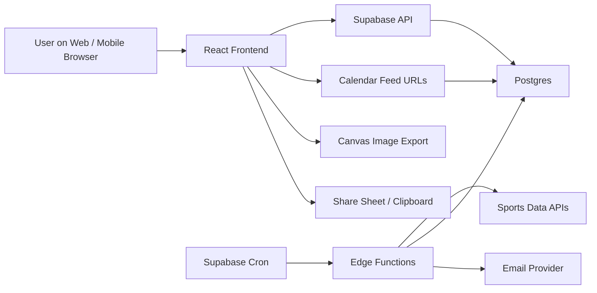
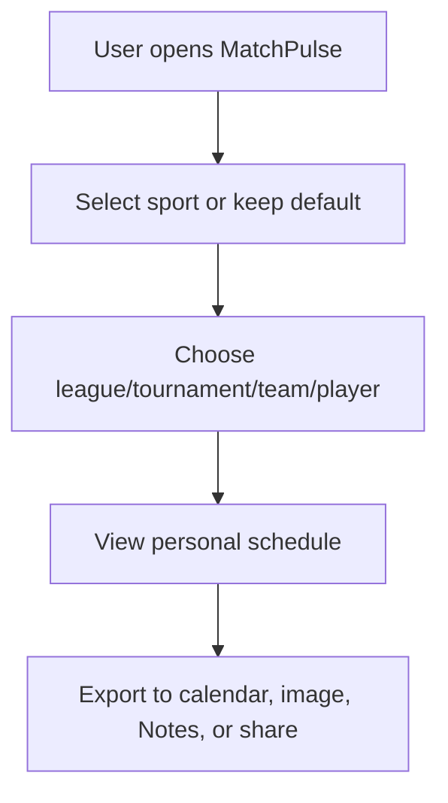

# Master Plan 1: Original Product And Technical Plan

Last updated: June 12, 2026 (revised after architecture/design review)

> Name note: Silbo Sports is now the visible in-app direction. "MatchPulse" remains legacy
> wording in older notes and internal/package cleanup only. Final legal, domain, and asset
> lock still needs to happen before the first public deploy.

## Decision Log

Decisions locked during the June 11, 2026 review:

- **Scope:** stay broad multi-sport. Keep the generic data model and the multi-sport UI on
  the roadmap. Soccer/World Cup remains the first polished vertical and the launch wedge
  (the tournament is live now), but other sports are not deferred out of the plan.
- **Frontend stack:** Tailwind CSS v4 + a *thin* subset of shadcn/ui (only components
  actually used), aligning the codebase with the design team's Figma Make output so handoffs
  are near-paste. The current hand-rolled `App.css` is retired during the refactor.
- **Visual direction:** bright/light theme (white + translucent panels, pitch-green), per
  Objective 2 and the Figma export. The shipped dark "stadium night" `App.css` is *not* the
  target look and is being replaced. High-energy accent color is reserved for export CTAs.
- **Reminder channels:** Email **and** Web Push (PWA service worker). SMS stays excluded.
- **Critical schema corrections vs. the first draft:** n-ary `event_competitors` join table
  (so F1/golf/tennis fields work, not just home/away), a `broadcasts` table (the "where to
  watch" wedge), and visibility-gated RLS on `events` so private custom-league events cannot
  leak through the public read policy.

## Status Audit — June 12, 2026

Objective-by-objective state of this plan against the shipped codebase and the live
Supabase project (`gcnbgdpicgeahxscpsfc`).

### Latest Audit Correction - June 12, 2026

The table below predates the latest implementation pass. Treat these corrections as the
current state until the full table is cleaned up:

- Objective 2 and 8: poster export now uses sport theme tokens, high-resolution PNG output,
  Silbo branding, and page-safe layout. Remaining work is committed mobile/a11y visual tests.
- Objective 3: auth UI for magic link and Google exists. Remaining work is remote Supabase
  apply/verification and wiring frontend reads/writes to user-scoped server tables.
- Objective 5: My Schedule now has expanded match cards, where-to-watch placeholders, and
  region/language/hour-format preferences. Remaining work is server follows,
  anonymous-to-account migration, attend/track intents, and finals-only filters.
- Objective 6: Calendar feed UI now supports local preview feeds, TBD/broadcast flags, copy
  URL, and `webcal://` opening. Remaining work is server-backed feed creation, production
  domain/proxy, token-hash verification, and full TBD/TENTATIVE feed rendering.
- Objective 7: the frontend now uses sport families rather than league tiles, including NFL/
  CFL/NCAA under American football, plus combat, track and field, and Olympic-sports staging.
  Remaining work is real event/league/team detail views and live provider data previews.
- Objective 9: custom leagues now have local share enable/disable, token rotation, and
  private-by-default controls. Remaining work is server-backed ownership, cross-device share
  resolution, and bulk import.
- Objective 14: message-key shell, soccer/football terminology, region picker, language
  picker, and 12/24-hour preference exist. Remaining work is full translations, onboarding,
  anonymous-to-account migration, and live personal share links.

### Latest Audit Correction - June 15, 2026

A large backend/wire-up pass has closed most of the June-12 gaps. Current state by objective
(supersedes the table below where they differ; see `docs/master-plan-4-backend-and-glue.md` for
the full writeup):

- **Obj 3 / 5 / 14 (auth + follows):** auth UI is live and *functional* — follows + preferences
  now persist to `user_follows` / `profiles` when signed in, with local→account merge on first
  sign-in. Following leagues and athletes works from the sport pages and event detail page.
- **Obj 4 (provider sync):** TheSportsDB hydrator runs on cron with diff-before-write change
  detection (`event_status_history`), ~37 leagues / ~8,400 events / ~5,150 athletes; freshness UI
  ("Live · via TheSportsDB · synced Xm ago") now shows on sport pages. Gap: raw payload snapshots.
- **Obj 6 (calendar feeds):** server-backed, hashed-token feeds via the deployed `calendar-feed`
  function (schema drift fixed); multi-sport filters; TBD→all-day/TENTATIVE rendering; emoji,
  CATEGORIES, VALARM reminders, and a working `/events/:id` back-link.
- **Obj 7 (multi-sport frontend):** real **Event Detail page** (`/events/:id`) shipped
  (time/venue/competitors/where-to-watch/follow/export). League/Team pages still placeholders.
- **Obj 10 (notifications):** worker is scheduled (5-min cron), the change-materializer RPC
  exists, and an **Alert settings UI** (`/settings/alerts`) writes `alert_preferences`. Email
  *transport* still needs `RESEND_API_KEY` + a verified domain; Web Push needs VAPID keys.
- **Obj 12 / 13 (CI + tests):** GitHub Actions CI (lint + test + build) added; 28 unit tests
  (ICS multi-sport builder, sport emoji, relative-time, plus the originals).
- **Still open (largest, as of June 15):** custom leagues server-backing / cross-device shares;
  email/push transport secrets; League/Team detail pages; admin dashboard (Obj 11); public frontend
  deploy automation (Obj 12). See the June-21 correction below for the updated state.

### Latest Audit Correction - June 21, 2026

The June-15 "still open" list has been materially reduced:

- **Obj 6 / 8 (calendar + exports):** My Schedule and exports now support multi-sport events,
  export-fit guidance, ICS-first recommendations, CSV, Notes/share text, image packs, and branded
  PDF generation. Live Sync feed creation writes real `calendar_feeds` rows when signed in.
- **Obj 9 (custom leagues):** custom leagues are server-backed when signed in, local leagues merge
  into the account path, public share pages resolve through `/s/:token`, and share controls exist.
  Remaining import work: true `.ics` import and CSV/Sheets import flows.
- **Obj 7 / 11 (routes + admin):** event detail, league pages, team pages, and `/admin` observability
  now exist. Admin still needs broader source-target/provider status panels.
- **Obj 10 (alerts):** alert settings, alert copy taxonomy, and notification materialization are
  wired. Email waits on Resend/domain secrets; Web Push waits on VAPID keys and send implementation.
- **Obj 12 / 13 (delivery + quality):** CI and Cloudflare deploy scripts/docs exist; unit tests cover
  ICS, feeds, export advice, PDF rendering, alerts, notes, pagination, conflicts, and live sport
  reads. Remaining quality gap: committed Playwright/mobile/a11y smoke tests.
- **Obj 4 / MP4 cache work:** provider `payload_hash`, `last_checked_at`, unchanged-payload
  short-circuiting, source targets, and calendar-feed ingestion are now in repo.

Largest remaining plan work: production secrets/domain verification, Playwright/mobile/a11y tests,
DB-backed spotlight/ranking tables, provider-adapter verification scripts, real broadcast/rightsholder
backfill, full i18n extraction, and structured fight-card/bracket/race-weekend data.

| Objective | Status | What's left |
|---|---|---|
| 1. Product foundation (nav, sport switcher, WC view, empty states) | ✅ Done | Switcher is now the brand block with per-sport icons; sport vs league split applied. |
| 2. Design system + sport themes | 🟢 ~90% | Per-sport themes + tokens + provider live (soccer/F1/NHL/NBA/tennis/golf/custom). **Gap:** the canvas poster still hardcodes the green palette — acceptance criterion "export images use the same theme tokens" not yet met. Multi-width visual QA partial. |
| 3. Supabase backend foundation | 🟢 ~85% | All 5 migrations + hardening applied to the live project; RLS verified by advisors; seeded (104 events, 48 competitors). **Gap:** auth UI (magic link + Google) not built, so user-scoped tables are unused. |
| 4. Provider sync + normalization | 🟡 ~60% | Adapter interface + `worldcup_json` adapter + diff-before-version-bump sync function deployed. **Gaps:** cron not scheduled, raw payload snapshots not stored, freshness UI is a simple Live/Bundled badge (no "updated X min ago"), no second provider. |
| 5. Follows + personal schedule | 🟡 ~60% | Local follows, My Schedule with ranges/hide-finished/conflict flags work; `user_follows` + `get_my_schedule` deployed. **Gaps:** no auth → server follows unused; intents (attend/track) and finals-only filter not in UI. |
| 6. Calendar feeds | 🟡 ~55% | `calendar-feed` Edge Function deployed (stable UID/SEQUENCE, RFC 5545 escaping/folding); snapshot `.ics` works; platform instructions in UI. **Gaps:** feed creation is localStorage-only with placeholder URLs (needs auth); no `webcal://` button; TBD/all-day/TENTATIVE rendering not implemented (see cross-doc review). |
| 7. Multi-sport frontend | 🟢 ~90% | App shell, My Schedule, Explore, sport pages, Calendar, Export Studio, Custom Leagues + admin, share pages, Event Detail, League, and Team routes all live. **Gaps:** deeper live provider previews and DB-backed spotlight/ranking. |
| 8. Export Studio | 🟢 ~90% | Templates, pagination (page X of Y), preview, share-sheet fallbacks, Notes export. **Gap:** poster theme tokens (same as Obj 2). |
| 9. Custom leagues | 🟡 ~65% | Full local CRUD + share page + ICS/notes exports; backend tables + private-event RLS + owner trigger deployed. **Gaps:** cross-device sharing needs auth + server resolution; no share disable/rotate UI; no bulk paste import. |
| 10. Notifications (email + push) | 🟡 ~50% | Queue, idempotent materializer, atomic claimer, channel-dispatching worker all deployed. **Gaps:** no alert-settings UI, `RESEND_API_KEY` not set, Web Push needs VAPID keys + send implementation, cron not scheduled. |
| 11. Admin + observability | 🟡 ~60% | `provider_sync_runs` + indexes live; security advisors run and acted on; `/admin` dashboard exists. **Gaps:** source-target/provider status panels, support tooling, and rate limiting on public endpoints. |
| 12. Deployment + CI | 🔴 ~20% | Migrations/functions in repo; env vars documented. **Gaps:** no public frontend deploy, no GitHub Actions workflow, no SEO/social previews. |
| 13. Quality + security | 🟡 ~50% | 19 unit tests (time/ICS/pagination/conflicts) green; DEFINER functions locked down. **Gaps:** no RLS tests, no feed-token tests, no a11y pass, no Playwright smoke. |
| 14. Wedge features (added in review) | 🟡 ~30% | Conflict detection shipped. **Gaps:** onboarding/first-run, anonymous→account migration (specced in auth doc), live share links for personal schedules, 12/24h toggle + full i18n. |

**Shortest path to "testable in public":** auth UI + anon→account migration → server-backed
feeds/custom leagues → deploy frontend + CI → set notification secrets + cron. Everything
else is enhancement.

## Cross-Document Review — June 12, 2026

The companion docs have been consolidated into [Master Plan 2](./master-plan-2.md). They were
strong and largely consistent with this plan. The following gaps and conflicts need a
decision before implementation; flagged here for team review.

1. **`calendar_feeds` schema drift (conflict).** Migration `0003` (deployed) stores a plain
   `token` and has none of the columns the calendar doc specifies (`token_hash`, `locale`,
   `include_placeholders`, `include_broadcasts`, `default_alarm_minutes`,
   `last_accessed_at`). Needs a `0006` migration to reconcile. Note the token-hash design
   changes UX: the raw URL can only be shown once at creation (current UI displays it
   forever). Recommend: adopt the doc's schema, hash with SHA-256, and add a "copy now —
   shown once" creation step.
2. **`event_status_history` vs `event_change_log` (conflict).** The TBD doc replaces the
   deployed status-history table with a broader change log carrying
   `significance: silent | calendar | notify`. The deployed sync function writes the old
   table. Recommend: adopt `event_change_log`, keep `event_status_history` as a view or
   drop it in the same migration, and update `provider-sync` in lockstep — otherwise
   notifications (which the TBD doc keys off `notify` rows) will have two sources of truth.
3. **Certainty model is not in the deployed schema (gap, expected).** `certainty`,
   `starts_at_precision`, `decision_*`, `event_dependencies`, `schedule_watch_requests` are
   all additive and fit cleanly. But note the knock-on: the deployed `calendar-feed`
   function renders only timed `VEVENT`s — it must learn all-day (`VALUE=DATE` +
   `TRANSP:TRANSPARENT`), `STATUS:TENTATIVE`, and `watch_only` exclusion when these land.
   Sequence the migration and the function update together.
4. **`get_shared_league` exposure (conflict).** The auth doc says privileged token lookup
   should move behind an Edge Function rather than a public SECURITY DEFINER RPC. The
   deployed RPC is narrow (token-gated, limited columns) and was accepted in the advisor
   review. Recommendation: keep the RPC while share pages are local-only; replace it with a
   `share-page` Edge Function in the same PR that makes shares server-backed. Don't carry
   both into production.
5. **Sport vs league taxonomy (conflict, partially fixed).** The catalog conflated leagues
   (NHL, NBA, F1) with sports. The UI now distinguishes sport (`Hockey`) from flagship
   league (`NHL`), per the consolidated regionalization rule. **Open item:** the seeded
   `sports` rows still use keys `nhl`/`nba`/`f1`; before adding WNBA/CFL/UFC, re-key sports
   to true sports (`hockey`, `basketball`, `motorsport`, `mma`) and hang leagues off the
   existing `leagues` table — otherwise WNBA would need its own fake "sport". URL keys can
   stay as-is per the regionalization rule (URLs stable, labels localized).
6. **Route conflict for `/`.** Master Plan 2: `/` = neutral multi-sport homepage.
   Auth doc: `/` or `/schedule` = personal schedule. Current app: `/` redirects to
   `/my-schedule`. Recommend the Master Plan 2 position: `/` becomes the homepage
   (track-intent hero + spotlight carousel), `/my-schedule` stays the signed-in/returning
   default via a "Continue your schedule" path. Also adopt `/sports/:sportKey/:leagueKey`
   before league pages are built.
7. **Feed URL domain.** Current preview UI prints `feeds.silbosports.com/calendar/:token.ics`;
   older docs may still reference `matchpulse.app/calendar/:token.ics`. The deployed
   function lives at `<project>.functions.supabase.co/calendar-feed/...`. Decide the public
   domain + proxy (and whether name change affects it — see naming doc) before the
   Calendar page prints real URLs. Until then the UI must keep labeling them as previews.
8. **UFC/fight cards (gap).** The consolidated bout model (card sections, corner
   competitors, bout order) is not representable in `event_competitors` alone. Plan a
   `event_bouts` child table when MMA is staged; `metadata` JSON is fine for the staged
   preview but not for following a fighter.
9. **i18n timing (risk).** Master Plan 2 correctly says to add the message-key
   layer *before* more copy hardens. Copy is hardening now (this sprint added more English
   strings). Recommend pulling the `t()` layer + terminology keys forward, ahead of the
   homepage build.
10. **Ads policy lives in two docs (minor).** Auth doc (custom-league ad rules, children
    caution) and homepage sponsorship rules should be merged
    into one ads/monetization policy section so the kids-privacy constraints provably apply
    to every surface, including sponsored spotlight cards.
11. **Email-capture-without-account (decision needed).** The TBD doc's "Email me when set"
    allows a lighter-than-account email capture, while the auth doc routes everything
    through magic-link accounts. These are different consent/storage paths
    (`schedule_watch_requests.email` + verification + unsubscribe tokens vs `auth.users`).
    Recommend: magic-link-only at MVP (it *is* the email capture), revisit standalone
    capture only if conversion data demands it.

## Purpose

This document is the working plan for turning MatchPulse from a World Cup scheduler prototype into a full multi-sport personal schedule service. It is meant to be shared with development teams and reused by Codex as the durable source of truth for product scope, backend architecture, frontend architecture, design direction, implementation sequence, and acceptance criteria.

SMS is intentionally excluded from this plan. Email reminders, calendar subscriptions, image exports, share sheets, and Notes-friendly text are included.

## One Sentence Vision

MatchPulse is the easiest way to follow the sports events you personally care about, across pro leagues, tournaments, Formula 1 weekends, tennis and golf events, and custom kids/community leagues, then push that schedule into your calendar, phone photos, notes, or family group chat.

## Product Wedge

FotMob is a strong inspiration for soccer UX because it has excellent daily match views, favorite teams, notifications, lineups, stats, news, and match detail pages. MatchPulse should not try to clone FotMob or scrape it. The differentiated product is personal scheduling:

- Less global live-score overload.
- More "what do I need to watch, attend, save, or share?"
- Strong calendar subscription support.
- Beautiful readable image exports.
- Plain text exports that work in Notes.
- Custom leagues for families, coaches, little leagues, pickup leagues, and kids sports.
- Multi-sport support from the beginning of the data model.

## Reference Inputs

### Current Prototype

The current repo contains a React/Vite prototype with:

- World Cup 2026 team selection.
- Local timezone conversion.
- `.ics` export.
- High-resolution readable PNG export.
- Phone share/download behavior.
- Notes-friendly copied schedule.

Known issues in the prototype carried into the refactor:

- The shipped `App.css` is a dark "stadium night" theme, which conflicts with the bright
  direction in Objective 2 and the Figma export. `index.css` is already bright; the dark
  `App.css` is the odd one out and is being replaced.
- The alert form still renders an SMS/"Text" channel even though SMS is excluded. Removed
  during the refactor.
- Kickoff parsing only handles whole-hour `UTC±H` offsets; half-hour zones (e.g. India
  `UTC+5:30`) are mangled. Latent for WC2026 (all whole-hour Americas offsets) but a real
  bug once the model goes global. Fixed during the refactor.
- All export logic (ICS, canvas poster, Notes text) lives inline in a single ~750-line
  `App.tsx`. Extracted into testable `src/lib/*` modules during the refactor.

### Figma Make Result

File inspected:

`C:\Users\azhar\Downloads\MatchPulse Scheduler Interface.zip`

Useful ideas from the Figma Make design:

- Sticky green tournament header.
- Brighter pitch-green theme.
- Team count badge.
- Compact checklist-style team selector.
- Central schedule column.
- Right-side alert/export utility panel.
- Dedicated `1080 x 1920` poster concept.
- Clear split between calendar export and image export.
- Stronger "selected teams -> match schedule" hierarchy.

The Figma design uses mock data and some generated characters that need cleanup, but the product layout direction is useful.

### External Docs To Re-check Before Implementation

These links are planning references. Providers and platform terms can change, so verify before signing up or deploying.

> **Licensing is a launch-blocking risk, not a footnote.** This product *redistributes*
> schedule data as public `.ics` feeds, shareable public links, and downloadable images.
> Most commercial sports-data APIs (API-Sports, Sportradar, SportsDataIO) **prohibit
> redistribution** in their default terms. Confirm per-provider redistribution rights
> *before* building sync against any of them. TheSportsDB and official open feeds (e.g.
> OpenF1) are more permissive but thinner. [Master Plan 2](./master-plan-2.md) now carries
> the provider evaluation, redistribution questions, and small-league sourcing notes.

- Supabase Scheduled Functions: https://supabase.com/docs/guides/functions/schedule-functions
- Supabase Cron: https://supabase.com/docs/guides/cron
- Supabase Edge Functions: https://supabase.com/docs/guides/functions
- Supabase Row Level Security: https://supabase.com/docs/guides/database/postgres/row-level-security
- TheSportsDB: https://www.thesportsdb.com/documentation
- API-Sports: https://api-sports.io/
- OpenF1: https://openf1.org/docs/
- SportsDataIO: https://sportsdata.io/apis
- Sportradar: https://developer.sportradar.com/getting-started/docs/get-started
- iCalendar RFC 5545: https://datatracker.ietf.org/doc/html/rfc5545
- Apple subscribed calendars: https://support.apple.com/guide/calendar/subscribe-to-calendars-icl1022/mac
- Outlook subscribe/import calendars: https://support.microsoft.com/en-us/office/import-or-subscribe-to-a-calendar-in-outlook-com-or-outlook-on-the-web-cff1429c-5af6-41ec-a5b4-74f2c278e98c
- Google Calendar shared/subscribed calendar help: https://support.google.com/calendar/answer/37100

## Guiding Principles

1. Mobile first, not mobile afterthought.
2. Calendar subscription is the preferred long-term export, not one-time file import.
3. Photo export prioritizes legibility over density.
4. Notes/plain text export should be clean enough to paste into Apple Notes, Google Keep, Notion, email, or a group chat.
5. Every sport uses one shared event model, but can have sport-specific language and themes.
6. Provider data is normalized into our database. The frontend should not depend directly on provider response shapes.
7. Custom leagues are first-class, not a hack.
8. RLS is mandatory for any user-owned or private data.
9. No scraping of FotMob or other apps. Use licensed APIs, public official feeds, or user-entered custom schedules.
10. The first production version should be useful even with limited live provider coverage.
11. The event model is n-ary from day one: an event has a list of competitors with roles,
    not a hardcoded home/away pair. Home/away is an optional convenience for 1v1 sports.
12. Anything that can be exported or shared publicly must only ever contain data the owner
    intended to be public. Private (custom-league, personal) data and public schedule data
    never share a permissive read policy.
13. Reminders use Email and Web Push only. No SMS. Web Push is the primary near-real-time
    channel; email is for digests and schedule-change notices.
14. "Where to watch" (broadcast/stream info) is a first-class part of the wedge, not a
    metadata afterthought.

## High-Level Architecture



## Core Domain Shape

The app should be built around generic events:

- A soccer match is an event.
- An NBA game is an event.
- An NHL game is an event.
- A Formula 1 practice, qualifying, sprint, or race is an event.
- A tennis match is an event.
- A golf round or tee time is an event.
- A kid's hockey practice is an event.

The sport controls labels, display rules, theme, and event subtypes. The backend storage stays mostly unified.

```ts
type SportKey = 'soccer' | 'f1' | 'nhl' | 'nba' | 'tennis' | 'golf' | 'custom';

type EventStatus =
  | 'scheduled'
  | 'time_tbd'
  | 'postponed'
  | 'cancelled'
  | 'live'
  | 'finished';

type EventKind =
  | 'match'
  | 'game'
  | 'race'
  | 'practice'
  | 'qualifying'
  | 'sprint'
  | 'round'
  | 'tee_time'
  | 'custom_event';

type ScheduleEvent = {
  id: string;
  sportKey: SportKey;
  leagueId: string | null;
  seasonId: string | null;
  providerId: string | null;
  providerEventId: string | null;
  kind: EventKind;
  status: EventStatus;
  startsAt: string | null;
  startsAtTbd: boolean;
  timezone: string | null;
  venueId: string | null;
  // Generic n-ary participation. A soccer match has two (home, away); an F1 race has a
  // full grid; a golf round has a field; a custom kids game has two custom teams.
  competitors: Array<{
    competitorId: string;
    role: 'home' | 'away' | 'driver' | 'player' | 'field' | 'participant';
    position?: number | null;
  }>;
  // Optional denormalized convenience for the 1v1 case only. Never the source of truth for
  // multi-competitor sports.
  homeCompetitorId: string | null;
  awayCompetitorId: string | null;
  // Where-to-watch, resolved for the user's region. Drives the "what do I need to watch" UI.
  broadcasts?: Array<{ country: string; channel: string; streamUrl?: string | null }>;
  visibility: 'public' | 'private';
  title: string;
  shortTitle: string;
  metadata: Record<string, unknown>;
};
```

> Why this matters: the first draft modeled participation as `homeCompetitorId` /
> `awayCompetitorId` only. That cannot represent an F1 grid, a golf field, or a tennis draw,
> and it makes "events featuring driver X" unanswerable. The `event_competitors` table
> (Objective 3) is the source of truth; home/away columns are an optional 1v1 shortcut.

## Objective 1: Product Foundation

### Goal

Reframe the app from a one-off World Cup scheduler into a multi-sport scheduling platform while keeping the current prototype useful.

### Frontend Work

- Add top-level product navigation:
  - Home
  - My Schedule
  - Explore
  - Calendar
  - Exports
  - Custom Leagues
- Add sport switcher:
  - Soccer
  - F1
  - NHL
  - NBA
  - Tennis
  - Golf
  - Custom
- Keep current World Cup view as the first soccer/tournament demo.
- Add a neutral `/` homepage that asks what the user wants to track across sports before
  sending them to My Schedule, Explore, a sport page, or Custom Leagues. See
  [Master Plan 2](./master-plan-2.md#phase-5-neutral-homepage-and-discovery).
- Replace hardcoded copy like "World Cup local-time watch planner" with context-aware titles.
- Add empty/loading states for unsupported sports while backend integrations are pending.

### Backend Work

- None required for the first refactor if we keep local demo data.
- Create placeholder types that match the future backend schema.

### Flow



### Code Concept

```ts
const sports = [
  { key: 'soccer', label: 'Soccer', enabled: true },
  { key: 'f1', label: 'F1', enabled: false },
  { key: 'nhl', label: 'NHL', enabled: false },
  { key: 'nba', label: 'NBA', enabled: false },
  { key: 'tennis', label: 'Tennis', enabled: false },
  { key: 'golf', label: 'Golf', enabled: false },
  { key: 'custom', label: 'Custom', enabled: false },
] as const;
```

### Acceptance Criteria

- The app still works for the World Cup scheduler.
- Users can see the broader multi-sport structure.
- Unsupported sport states feel intentional, not broken.
- Mobile layout remains clean.

## Objective 2: Design System And Sports Themes

### Goal

Create one consistent MatchPulse design system that can change mood by sport, league, tournament, or race country without becoming seven separate products.

### Stack And Tooling (locked)

- **Tailwind CSS v4** as the styling engine, using the `@theme` token layer to back the
  design tokens below. This replaces the hand-rolled `App.css`.
- **A thin subset of shadcn/ui** — copy in only the primitives actually used (button, card,
  input, checkbox, select, dialog/sheet, tabs, badge, tooltip). The Figma Make export ships
  ~50 shadcn components; do **not** import them all. `sidebar.tsx`, `chart.tsx`, `menubar`,
  etc. are dead weight until a screen needs them.
- **The Figma export is a visual reference, not a code source.** Its `App.tsx` is inline-hex
  spaghetti (`style={{ color: '#156b44' }}` everywhere), which is the opposite of the token
  system below. Reuse its layout (sticky header, 3-12-3 grid, poster preview) and palette;
  rewrite the implementation against tokens.

### Design Direction

Base design (bright is the locked direction — the shipped dark `App.css` is being retired):

- Bright, clean, mobile-first.
- White and translucent panels.
- Strong readable text.
- Sports texture in the background, not behind dense body copy.
- Export CTAs use higher energy colors.

Sport themes:

- Soccer: pitch stripes, stadium lines, trophy gold, lime/cyan.
- World Cup: FIFA/WC inspired greens, gold, bright global/tournament accents.
- EPL: red, white, navy, crisp broadcast feel.
- La Liga: red/yellow, warmer sunlit stadium cues.
- Bundesliga: red/yellow/black, bold high contrast.
- Ligue 1: red/blue/white.
- F1: track curves, carbon fiber, timing tower, race-country accents.
- NHL: ice texture, rink lines, cold white/blue, puck/scoreboard motifs.
- NBA: court wood, orange/black, arena lights.
- Tennis: hard/clay/grass court variants.
- Golf: scorecard, fairway green, understated clubhouse palette.
- Olympics: ring-color accent system, clean international event look.

### Frontend Work

- Add a `themes.ts` file.
- Add CSS variables for theme tokens.
- Add `SportThemeProvider` at app root.
- Convert current CSS colors into theme variables.
- Build `ScheduleCard`, `TeamChip`, `ExportButton`, `SportSwitcher`, `LeagueBadge`, `EventTimeBlock` components.
- Add visual QA at desktop, iPhone width, Android width.

### Backend Work

- Store optional theme metadata on sports/leagues/events:
  - primary color
  - secondary color
  - accent color
  - background motif
  - logo/artwork URL
  - theme mode

### Code Concept

```ts
export type SportTheme = {
  key: string;
  label: string;
  colors: {
    bg: string;
    surface: string;
    text: string;
    primary: string;
    secondary: string;
    accent: string;
    export: string;
  };
  motifs: {
    background: 'pitch' | 'track' | 'ice' | 'court' | 'fairway' | 'rings' | 'neutral';
    cardShape: 'ticket' | 'scoreboard' | 'slab' | 'poster';
  };
};

export const soccerTheme: SportTheme = {
  key: 'soccer',
  label: 'Soccer',
  colors: {
    bg: '#e4fae8',
    surface: '#ffffff',
    text: '#0b2819',
    primary: '#0c5c31',
    secondary: '#d8ff49',
    accent: '#42e7ff',
    export: '#ff6b1a',
  },
  motifs: {
    background: 'pitch',
    cardShape: 'ticket',
  },
};
```

```tsx
function SportThemeProvider({ theme, children }: PropsWithChildren<{ theme: SportTheme }>) {
  return (
    <div
      data-sport={theme.key}
      style={{
        '--mp-bg': theme.colors.bg,
        '--mp-surface': theme.colors.surface,
        '--mp-text': theme.colors.text,
        '--mp-primary': theme.colors.primary,
        '--mp-secondary': theme.colors.secondary,
        '--mp-accent': theme.colors.accent,
        '--mp-export': theme.colors.export,
      } as React.CSSProperties}
    >
      {children}
    </div>
  );
}
```

### Acceptance Criteria

- Changing a sport key changes theme without changing component code.
- World Cup, F1, NHL, and NBA can be mocked with distinct looks.
- Export images use the same theme tokens.
- The UI never becomes illegible because of a theme.

## Objective 3: Supabase Backend Foundation

### Goal

Build a durable backend that can store sports, leagues, provider events, user follows, calendar feeds, custom leagues, and reminders.

### Frontend Work

- Add Supabase client.
- Add auth UI only where needed:
  - save follows
  - manage custom leagues
  - manage feeds
  - manage email reminders
- Keep anonymous browsing possible.

### Backend Work

- Create Supabase project.
- Add schema migrations.
- Enable RLS.
- Create public read policies for public sports data.
- Create user-scoped policies for saved preferences and custom league admin data.
- Add Edge Function scaffolds.
- Add Cron job scaffolds.

### Schema Concept

```sql
create table public.sports (
  id uuid primary key default gen_random_uuid(),
  key text not null unique,
  name text not null,
  default_theme jsonb not null default '{}'::jsonb,
  created_at timestamptz not null default now()
);

create table public.leagues (
  id uuid primary key default gen_random_uuid(),
  sport_id uuid not null references public.sports(id),
  provider_key text,
  provider_league_id text,
  name text not null,
  short_name text,
  country text,
  logo_url text,
  theme jsonb not null default '{}'::jsonb,
  is_public boolean not null default true,
  created_at timestamptz not null default now(),
  unique (provider_key, provider_league_id)
);

create table public.seasons (
  id uuid primary key default gen_random_uuid(),
  league_id uuid not null references public.leagues(id),
  label text not null,
  starts_on date,
  ends_on date,
  provider_season_id text,
  is_current boolean not null default false
);

create table public.venues (
  id uuid primary key default gen_random_uuid(),
  name text not null,
  city text,
  region text,
  country text,
  timezone text,
  latitude double precision,
  longitude double precision
);

create table public.competitors (
  id uuid primary key default gen_random_uuid(),
  sport_id uuid not null references public.sports(id),
  league_id uuid references public.leagues(id),
  kind text not null check (kind in ('team', 'person', 'constructor', 'custom_team')),
  name text not null,
  short_name text,
  country text,
  logo_url text,
  theme jsonb not null default '{}'::jsonb,
  provider_key text,
  provider_competitor_id text,
  unique (provider_key, provider_competitor_id)
);

create table public.events (
  id uuid primary key default gen_random_uuid(),
  sport_id uuid not null references public.sports(id),
  league_id uuid references public.leagues(id),
  season_id uuid references public.seasons(id),
  venue_id uuid references public.venues(id),
  provider_key text,
  provider_event_id text,
  kind text not null,
  status text not null default 'scheduled',
  title text not null,
  short_title text,
  starts_at timestamptz,
  starts_at_tbd boolean not null default false,
  timezone text,
  -- Optional 1v1 convenience only. Source of truth is public.event_competitors below.
  home_competitor_id uuid references public.competitors(id),
  away_competitor_id uuid references public.competitors(id),
  -- Gates the public read policy. Custom-league/personal events are 'private'.
  visibility text not null default 'public' check (visibility in ('public', 'private')),
  -- custom_league_id FK is added in the custom-leagues migration (Objective 9) to avoid a
  -- forward reference; events created there are inserted with visibility = 'private'.
  custom_league_id uuid,
  metadata jsonb not null default '{}'::jsonb,
  version integer not null default 1,
  created_at timestamptz not null default now(),
  updated_at timestamptz not null default now(),
  unique (provider_key, provider_event_id)
);

-- N-ary participation. THIS is the source of truth for who is in an event.
-- A soccer match has 2 rows; an F1 race has ~20; a golf round has the field.
create table public.event_competitors (
  id uuid primary key default gen_random_uuid(),
  event_id uuid not null references public.events(id) on delete cascade,
  competitor_id uuid not null references public.competitors(id) on delete cascade,
  role text not null check (role in ('home', 'away', 'driver', 'player', 'field', 'participant')),
  position integer,
  unique (event_id, competitor_id)
);

create index event_competitors_competitor_idx on public.event_competitors (competitor_id);
create index event_competitors_event_idx on public.event_competitors (event_id);

-- Where-to-watch. The differentiated answer to "what do I need to watch?".
create table public.broadcasts (
  id uuid primary key default gen_random_uuid(),
  event_id uuid not null references public.events(id) on delete cascade,
  country text not null,
  channel text not null,
  stream_url text,
  kind text not null default 'tv' check (kind in ('tv', 'stream', 'radio')),
  created_at timestamptz not null default now(),
  unique (event_id, country, channel)
);

create index broadcasts_event_idx on public.broadcasts (event_id);

create table public.event_status_history (
  id uuid primary key default gen_random_uuid(),
  event_id uuid not null references public.events(id) on delete cascade,
  old_status text,
  new_status text,
  old_starts_at timestamptz,
  new_starts_at timestamptz,
  changed_at timestamptz not null default now(),
  source text not null
);
```

### RLS Concept

```sql
alter table public.sports enable row level security;
alter table public.leagues enable row level security;
alter table public.events enable row level security;

create policy "public sports are readable"
on public.sports for select
to anon, authenticated
using (true);

create policy "public leagues are readable"
on public.leagues for select
to anon, authenticated
using (is_public = true);

-- CRITICAL: must be gated on visibility, NOT `using (true)`. Custom-league and personal
-- events live in this same table; a blanket true policy would expose every private
-- kids'-league schedule to the public. Private events are reached through the
-- custom-league policies (Objective 9) instead.
create policy "public events are readable"
on public.events for select
to anon, authenticated
using (visibility = 'public');

-- event_competitors / broadcasts inherit the same exposure as their parent event.
alter table public.event_competitors enable row level security;
alter table public.broadcasts enable row level security;

create policy "competitors of public events are readable"
on public.event_competitors for select
to anon, authenticated
using (
  exists (
    select 1 from public.events e
    where e.id = event_competitors.event_id and e.visibility = 'public'
  )
);

create policy "broadcasts of public events are readable"
on public.broadcasts for select
to anon, authenticated
using (
  exists (
    select 1 from public.events e
    where e.id = broadcasts.event_id and e.visibility = 'public'
  )
);
```

> This was the most dangerous bug in the first draft: a `using (true)` policy on `events`
> combined with "store custom events in the same `events` table" (Objective 9) would have
> made every private custom-league schedule world-readable.

Private events also need an explicit *positive* read path for the people who should see
them — custom-league owners and members. Without this, even the league owner cannot read
their own events through PostgREST:

```sql
create policy "custom league members read their private events"
on public.events for select
to authenticated
using (
  visibility = 'private'
  and custom_league_id is not null
  and exists (
    select 1 from public.custom_league_members m
    where m.custom_league_id = events.custom_league_id
      and m.user_id = auth.uid()
  )
);
```

(The league owner is always inserted as a `custom_league_members` row with role `owner`, so
one membership-based policy covers owners, admins, and viewers.) `get_my_schedule` runs as
`security invoker`, so this policy automatically extends the personal schedule to private
events the caller is allowed to see — no separate query logic needed, but the function's
follow-join must also accept `target_type = 'custom_league'` matching `e.custom_league_id`.

### Acceptance Criteria

- Local migrations exist.
- RLS enabled for exposed public tables.
- Public schedule data can be read by anonymous users.
- Private user/custom data cannot be read by other users.

## Objective 4: Provider Integration And Normalization

### Goal

Pull live schedule data from external sports APIs, normalize it into our event model, and track changes over time.

### Provider Strategy

Start with:

1. TheSportsDB or API-Sports for broad multi-sport schedule coverage.
2. OpenF1 for a strong F1 path.
3. Keep World Cup JSON/static import as a demo/fallback.

Evaluate later:

- SportsDataIO for North American sports.
- Sportradar or Stats Perform for enterprise coverage.

### Frontend Work

- Show provider freshness:
  - "Updated 12 min ago"
  - "Schedule source: API-Sports"
  - "Times may change"
- Add schedule changed UI markers.

### Backend Work

- Create provider adapter interface.
- Create sync Edge Function.
- Create Cron schedule by provider/sport.
- Store raw provider payload snapshots for debugging.
- Upsert leagues, teams/competitors, venues, and events.
- Insert status history when event time/status changes.

### Provider Adapter Concept

```ts
export type ProviderKey = 'worldcup_json' | 'thesportsdb' | 'api_sports' | 'openf1';

export type ProviderEvent = {
  providerKey: ProviderKey;
  providerEventId: string;
  sportKey: SportKey;
  leagueExternalId?: string;
  seasonExternalId?: string;
  kind: EventKind;
  status: EventStatus;
  title: string;
  shortTitle?: string;
  startsAt?: string;
  startsAtTbd?: boolean;
  timezone?: string;
  venue?: {
    name: string;
    city?: string;
    country?: string;
    timezone?: string;
  };
  competitors: Array<{
    role: 'home' | 'away' | 'driver' | 'player' | 'field';
    providerCompetitorId?: string;
    name: string;
    shortName?: string;
    country?: string;
  }>;
  metadata: Record<string, unknown>;
  raw: unknown;
};

export interface SportsProviderAdapter {
  key: ProviderKey;
  listLeagues(): Promise<ProviderLeague[]>;
  listEvents(input: { leagueId?: string; season?: string; from: string; to: string }): Promise<ProviderEvent[]>;
}
```

### Sync Edge Function Concept

```ts
import { createClient } from 'npm:@supabase/supabase-js';
import { getAdapter } from './providers/index.ts';

Deno.serve(async (req) => {
  const { providerKey, sportKey, from, to } = await req.json();
  const supabase = createClient(
    Deno.env.get('SUPABASE_URL')!,
    Deno.env.get('SUPABASE_SERVICE_ROLE_KEY')!,
  );

  const adapter = getAdapter(providerKey);
  const providerEvents = await adapter.listEvents({ from, to });

  for (const providerEvent of providerEvents) {
    await upsertNormalizedEvent(supabase, providerEvent);
  }

  await supabase.from('provider_sync_runs').insert({
    provider_key: providerKey,
    sport_key: sportKey,
    status: 'success',
    fetched_count: providerEvents.length,
  });

  return Response.json({ ok: true, count: providerEvents.length });
});
```

### Upsert And Versioning Rule

`upsertNormalizedEvent` must **diff before it writes**. Bumping `version` (and therefore the
calendar `SEQUENCE`) on every sync run — even when nothing changed — makes every calendar
client re-notify the user on every poll. The rule:

- Match the existing row by `(provider_key, provider_event_id)`.
- Update fields unconditionally **except** `version`.
- Increment `version` when **any calendar-visible field** changes — not just `starts_at` and
  `status`. That includes `title` (SUMMARY), venue (LOCATION), description text,
  cancellation notes, and broadcast info that is rendered into DESCRIPTION. If a subscribed
  calendar would render differently, SEQUENCE must bump; if not, it must not.
- Only `starts_at`/`status` changes *additionally* insert an `event_status_history` row —
  that table drives user-facing change notifications (Objective 10), and users should not
  be notified about a venue-name typo fix.
- Replace `event_competitors` / `broadcasts` for the event transactionally.

### Acceptance Criteria

- One provider can sync events into Postgres.
- Re-running sync updates existing events rather than duplicating.
- Time/status changes create status history rows.
- Frontend can display provider freshness.

## Objective 5: User Follows And Personal Schedule

### Goal

Let users build a personal schedule by following sports, leagues, teams, competitors, players/drivers, and custom leagues.

### Frontend Work

- Follow buttons on:
  - sport
  - league
  - team
  - player/driver
  - custom league
- "My Schedule" page.
- Date range controls:
  - Today
  - This Weekend
  - Next 7 Days
  - Tournament
  - Custom range
- Filter toggles:
  - Watching
  - Attending
  - My teams
  - Finals/playoffs only
  - Hide finished

### Backend Work

- Store follows.
- Store per-user timezone and preferred city.
- Store saved schedule preferences.
- Build RPC/view for personal schedule.

### Schema Concept

```sql
create table public.profiles (
  user_id uuid primary key references auth.users(id) on delete cascade,
  display_name text,
  default_timezone text,
  default_city text,
  created_at timestamptz not null default now(),
  updated_at timestamptz not null default now()
);

create table public.user_follows (
  id uuid primary key default gen_random_uuid(),
  user_id uuid not null references auth.users(id) on delete cascade,
  target_type text not null check (target_type in ('sport', 'league', 'team', 'competitor', 'player', 'custom_league')),
  target_id uuid not null,
  intent text not null default 'watch' check (intent in ('watch', 'attend', 'track')),
  created_at timestamptz not null default now(),
  unique (user_id, target_type, target_id, intent)
);

alter table public.user_follows enable row level security;

create policy "users manage their follows"
on public.user_follows
for all
to authenticated
using (auth.uid() = user_id)
with check (auth.uid() = user_id);
```

### Personal Schedule Query Concept

```sql
create or replace function public.get_my_schedule(
  start_at timestamptz,
  end_at timestamptz
)
returns setof public.events
language sql
security invoker
as $$
  select distinct e.*
  from public.events e
  join public.user_follows f
    on f.user_id = auth.uid()
   and (
     (f.target_type = 'sport' and f.target_id = e.sport_id)
     or (f.target_type = 'league' and f.target_id = e.league_id)
     -- team / competitor / player / driver all resolve through event_competitors, so this
     -- works for F1 grids, golf fields, and tennis draws, not just 1v1 home/away.
     or (
       f.target_type in ('team', 'competitor', 'player')
       and exists (
         select 1 from public.event_competitors ec
         where ec.event_id = e.id and ec.competitor_id = f.target_id
       )
     )
   )
  where e.starts_at >= start_at
    and e.starts_at < end_at
  order by e.starts_at asc;
$$;
```

### Acceptance Criteria

- Authenticated users can save follows.
- My Schedule aggregates followed targets.
- Anonymous users can still use temporary local follows.
- Mobile follow/unfollow states are obvious.

## Objective 6: Calendar Feeds And Schedule Updates

### Goal

Support both one-time `.ics` downloads and live subscribed calendar feeds that update when event times change.

### Product Rule

- "Download .ics" is a snapshot.
- "Subscribe calendar" is the live version.
- The product should strongly prefer subscribed calendars when a user wants ongoing updates.

### Frontend Work

- Calendar page:
  - Create feed
  - Name feed
  - Choose what it includes
  - Copy URL
  - Add to Apple Calendar
  - Add to Google Calendar
  - Add to Outlook
- Explain refresh limitations:
  - Calendar apps decide their own refresh timing.
  - Updates are not always instant.
- Feed management:
  - regenerate token
  - disable feed
  - delete feed

### Backend Work

- Store feed tokens.
- Generate iCalendar from DB.
- Use stable `UID` values.
- Include `DTSTAMP`, `LAST-MODIFIED`, `SEQUENCE`.
- Increment event version on meaningful time/status changes.

### Schema Concept

```sql
create table public.calendar_feeds (
  id uuid primary key default gen_random_uuid(),
  user_id uuid references auth.users(id) on delete cascade,
  token text not null unique,
  name text not null,
  timezone text not null,
  filters jsonb not null default '{}'::jsonb,
  is_active boolean not null default true,
  created_at timestamptz not null default now(),
  updated_at timestamptz not null default now()
);

alter table public.calendar_feeds enable row level security;

create policy "users manage their calendar feeds"
on public.calendar_feeds
for all
to authenticated
using (auth.uid() = user_id)
with check (auth.uid() = user_id);
```

### Calendar Generator Concept

```ts
function eventToIcs(event: ScheduleEvent) {
  const uid = `${event.id}@silbosports.com`;
  const sequence = event.version ?? 1;
  const dtstamp = formatIcsDate(new Date());
  const lastModified = formatIcsDate(new Date(event.updatedAt));

  return [
    'BEGIN:VEVENT',
    `UID:${uid}`,
    `SEQUENCE:${sequence}`,
    `DTSTAMP:${dtstamp}`,
    `LAST-MODIFIED:${lastModified}`,
    `DTSTART:${formatIcsDate(new Date(event.startsAt!))}`,
    `DTEND:${formatIcsDate(addHours(new Date(event.startsAt!), 2))}`,
    `SUMMARY:${escapeIcsText(event.title)}`,
    event.venueName ? `LOCATION:${escapeIcsText(event.venueName)}` : '',
    `DESCRIPTION:${escapeIcsText(event.description ?? '')}`,
    'END:VEVENT',
  ].filter(Boolean).join('\r\n');
}
```

### Feed Route Concept

```ts
// Edge Function: GET /calendar/:token.ics
Deno.serve(async (req) => {
  const token = new URL(req.url).pathname.split('/').pop()?.replace('.ics', '');
  const feed = await loadFeedByToken(token);

  if (!feed?.is_active) {
    return new Response('Not found', { status: 404 });
  }

  const events = await loadEventsForFeed(feed);
  const ics = renderCalendar(feed, events);

  return new Response(ics, {
    headers: {
      'content-type': 'text/calendar; charset=utf-8',
      'cache-control': 'public, max-age=300',
    },
  });
});
```

### Acceptance Criteria

- One-time `.ics` download works.
- Subscription URL works without login because it uses an unguessable token.
- Updated event times are reflected in the feed.
- Deleted/disabled feed returns 404.
- Instructions exist for Apple, Google, and Outlook.

### Companion Detail

See [Master Plan 2](./master-plan-2.md#phase-7-tbd-fixtures-change-tracking-and-notifications)
for how the product handles participant TBD, time TBD, date TBD, bracket placeholders,
watch requests, email/push updates, subscribed calendar refresh limits, and later
Google/Outlook direct-sync integrations.

See [Master Plan 2](./master-plan-2.md#phase-3-server-backed-calendar-feeds-and-custom-league-shares)
and [Phase 8](./master-plan-2.md#phase-8-direct-calendar-integrations-later) for the
implementation-grade frontend/backend plan covering snapshot exports, live feed tokens,
iCalendar rendering, platform-specific setup UX, change/versioning rules, and later
Google/Microsoft direct calendar sync.

## Objective 7: Multi-Sport Frontend Experience

### Goal

Build an interface that works for soccer, F1, NHL, NBA, Tennis, Golf, and custom leagues without clutter.

### Key Screens

1. My Schedule
   - The default home screen after onboarding.
   - Shows only followed items.

2. Explore Sports
   - Choose sport, league, tournament, team, player/driver.

3. League/Tournament Page
   - Schedule, standings link/placeholder, follow controls.

4. Team/Competitor Page
   - Upcoming events, calendar/feed buttons, export image.

5. Event Detail
   - Time, venue, broadcast, status, follow/attend, export/share.

6. Calendar Feeds
   - Create/manage live calendar subscriptions.

7. Export Studio
   - Calendar, image, Notes, share settings.

8. Custom League Admin
   - Create league, teams, events, share link.

### Frontend Components

```text
AppShell
SportSwitcher
LeaguePicker
FollowButton
ScheduleList
ScheduleCard
EventTimeBlock
EventStatusBadge
ThemeBackground
ExportPanel
CalendarFeedPanel
ImageExportPreview
NotesExportPanel
CustomLeagueForm
CustomEventEditor
```

### Example Route Shape

```ts
const routes = [
  '/my-schedule',
  '/sports/:sportKey',
  '/leagues/:leagueId',
  '/teams/:teamId',
  '/events/:eventId',
  '/calendar',
  '/exports',
  '/custom-leagues',
  '/custom-leagues/:leagueId/admin',
  '/s/:publicShareToken',
];
```

### Acceptance Criteria

- One app shell supports all sports.
- Soccer remains best polished first.
- F1 and NHL can be shown with mocked themed data before live provider work.
- Mobile navigation is not crowded.

## Objective 8: Photo, Share, And Notes Export Studio

### Goal

Create the best schedule export experience of any sports app.

### Product Rules

- Calendar is best for ongoing schedule tracking.
- Photo is best for quick visual reference and sharing.
- Notes/plain text is best for family planning and simple copy-paste.
- Big schedules must paginate.
- Photo export must never become tiny unreadable text.

### Frontend Work

- Export Studio UI:
  - Export target: Calendar, Photos, Notes, Share
  - Range: Today, Weekend, Next 7 Days, Team, League, Custom
  - Template: Compact, Poster, Family, Tournament
  - Page size: phone story, square, printable, compact list
- Preview before export.
- Use Web Share API when available.
- Fallback to download or clipboard.

### Backend Work

- Optional later: store export presets.
- Optional later: server-render export images for social previews.
- Not required for MVP because canvas export can happen client-side.

### Image Export Pagination Concept

```ts
const MAX_EVENTS_BY_TEMPLATE = {
  story: 7,
  poster: 9,
  compact: 12,
  family: 6,
};

function paginateEvents(events: ScheduleEvent[], template: keyof typeof MAX_EVENTS_BY_TEMPLATE) {
  const size = MAX_EVENTS_BY_TEMPLATE[template];
  const pages: ScheduleEvent[][] = [];

  for (let i = 0; i < events.length; i += size) {
    pages.push(events.slice(i, i + size));
  }

  return pages;
}
```

### Notes Export Concept

```ts
function buildNotesSchedule(events: ScheduleEvent[], timezone: string) {
  return groupByDay(events, timezone)
    .map((group) => {
      const rows = group.events.map((event) => {
        return [
          `${formatTime(event.startsAt, timezone)} - ${event.title}`,
          event.venueName ? `Venue: ${event.venueName}` : '',
          event.broadcast ? `Watch: ${event.broadcast}` : '',
        ].filter(Boolean).join('\n');
      });

      return [`${group.label}`, ...rows].join('\n\n');
    })
    .join('\n\n');
}
```

### Acceptance Criteria

- A 30-event schedule exports as multiple readable images.
- Each image has title, timezone, date range, page count, and readable event rows.
- Notes export is grouped by date.
- Mobile share sheet works when supported.
- Fallbacks work in desktop browsers.

## Objective 9: Custom Leagues

### Goal

Let parents, coaches, organizers, and friends create and share schedules for little league, kids sports, pickup leagues, school teams, or local tournaments.

### Frontend Work

- Custom League creation:
  - league name
  - sport
  - timezone
  - location
  - theme
- Team creation.
- Event creation:
  - opponent/team
  - date/time
  - venue
  - arrival time
  - uniform color
  - notes
  - status
- Public share page:
  - read-only schedule
  - subscribe calendar
  - save image
  - copy Notes
- Admin page:
  - edit schedule
  - notify subscribers by email later

### Backend Work

- Store custom leagues and teams.
- Store memberships/admin roles.
- Store custom events in the same `events` table or a linked table.
- Public share token for read-only access.
- Calendar feed support for custom leagues.

### Schema Concept

```sql
create table public.custom_leagues (
  id uuid primary key default gen_random_uuid(),
  owner_user_id uuid not null references auth.users(id) on delete cascade,
  sport_id uuid references public.sports(id),
  name text not null,
  timezone text not null,
  public_token text not null unique,
  theme jsonb not null default '{}'::jsonb,
  created_at timestamptz not null default now(),
  updated_at timestamptz not null default now()
);

create table public.custom_league_members (
  id uuid primary key default gen_random_uuid(),
  custom_league_id uuid not null references public.custom_leagues(id) on delete cascade,
  user_id uuid not null references auth.users(id) on delete cascade,
  role text not null check (role in ('owner', 'admin', 'viewer')),
  unique (custom_league_id, user_id)
);

create table public.custom_teams (
  id uuid primary key default gen_random_uuid(),
  custom_league_id uuid not null references public.custom_leagues(id) on delete cascade,
  name text not null,
  color text,
  created_at timestamptz not null default now()
);
```

### RLS Concept

```sql
alter table public.custom_leagues enable row level security;
alter table public.custom_league_members enable row level security;
alter table public.custom_teams enable row level security;

create policy "owners can manage custom leagues"
on public.custom_leagues
for all
to authenticated
using (auth.uid() = owner_user_id)
with check (auth.uid() = owner_user_id);
```

### Acceptance Criteria

- User can create a custom league.
- User can add/edit/delete custom events.
- Public share page does not require login.
- Calendar subscription works for custom league.
- Image and Notes exports work for custom league.

### Companion Detail

See [Master Plan 2](./master-plan-2.md#phase-2-auth-anonymous-migration-and-user-owned-data)
and [Phase 4](./master-plan-2.md#phase-4-custom-league-imports-admin-and-family-privacy) for
the full account strategy, anonymous-to-account migration flow, custom-league editor shape,
public share/export model, hosting plan, ad-slot guidance, privacy guardrails, and the
implementation checklist for this product area.

## Objective 10: Notifications — Email And Web Push

### Goal

Send useful reminders and change notifications over **Email and Web Push**, without SMS.
Web Push (via a PWA service worker, supported on Chrome/Firefox/Edge and on iOS 16.4+ for
installed web apps) is the primary near-real-time channel — it is free, instant, and the
natural fit for "kickoff in 30 minutes." Email covers digests, schedule-change notices, and
users who never install the PWA.

### Frontend Work

- Alert settings:
  - reminder lead time
  - schedule changed
  - event cancelled/postponed
  - new event added
- Per-feed and per-follow alert controls.
- Clear opt-in language.
- Unsubscribe/manage link in every email.

### Backend Work

- Store alert preferences.
- Use Edge Function and Cron to find upcoming reminders.
- Use provider sync change history to trigger schedule-change emails.
- Integrate with email provider such as Resend, Postmark, or SendGrid.

### Schema Concept

```sql
create table public.alert_preferences (
  id uuid primary key default gen_random_uuid(),
  user_id uuid not null references auth.users(id) on delete cascade,
  target_type text not null,
  target_id uuid not null,
  email_enabled boolean not null default true,
  remind_minutes_before integer not null default 60,
  notify_time_changes boolean not null default true,
  notify_cancellations boolean not null default true,
  created_at timestamptz not null default now(),
  updated_at timestamptz not null default now()
);

-- Web Push subscriptions (one per browser/device the user installs).
create table public.push_subscriptions (
  id uuid primary key default gen_random_uuid(),
  user_id uuid not null references auth.users(id) on delete cascade,
  endpoint text not null unique,
  p256dh text not null,
  auth text not null,
  created_at timestamptz not null default now()
);

alter table public.push_subscriptions enable row level security;
create policy "users manage their push subscriptions"
on public.push_subscriptions for all to authenticated
using (auth.uid() = user_id) with check (auth.uid() = user_id);

-- Channel-agnostic delivery queue (email + push share one table and one worker).
create table public.notification_deliveries (
  id uuid primary key default gen_random_uuid(),
  user_id uuid references auth.users(id) on delete set null,
  event_id uuid references public.events(id) on delete cascade,
  channel text not null check (channel in ('email', 'push')),
  kind text not null check (kind in ('reminder', 'time_change', 'cancellation', 'new_event')),
  scheduled_for timestamptz not null,
  sent_at timestamptz,
  status text not null default 'pending' check (status in ('pending', 'sending', 'sent', 'failed', 'skipped')),
  error text,
  -- Idempotency: a given user gets at most one delivery of a given kind per event per channel.
  unique (user_id, event_id, channel, kind)
);

create index notification_deliveries_due_idx
  on public.notification_deliveries (scheduled_for)
  where status = 'pending';
```

### Materializing Reminders (the missing step)

The first draft had a send-loop and a preferences table but nothing that *created* the rows
to send. A Cron-driven "materializer" closes the gap:

1. For each user with `email_enabled`/push enabled, expand `alert_preferences × upcoming
   events (from follows) × lead time` into `notification_deliveries` rows with
   `scheduled_for = starts_at - remind_minutes_before`.
2. The `unique (user_id, event_id, channel, kind)` constraint makes the materializer
   idempotent — re-running never double-queues.
3. The send worker (below) picks up due `pending` rows and dispatches via the row's channel.
4. `time_change` / `cancellation` deliveries are created off `event_status_history` rows
   written by the sync diff (Objective 4), so users are only notified on real changes.

### Send Worker Concept

The worker must (a) dispatch by the row's `channel`, not assume email, and (b) **claim rows
atomically** so overlapping cron runs cannot double-send. Claiming uses
`FOR UPDATE SKIP LOCKED` inside a SQL function so two workers never pick up the same row:

```sql
create or replace function public.claim_due_notifications(batch_size int default 100)
returns setof public.notification_deliveries
language sql
security definer
as $$
  update public.notification_deliveries d
  set status = 'sending'
  where d.id in (
    select id from public.notification_deliveries
    where status = 'pending' and scheduled_for <= now()
    order by scheduled_for
    limit batch_size
    for update skip locked
  )
  returning d.*;
$$;
```

```ts
Deno.serve(async () => {
  const claimed = await claimDueNotifications();

  for (const notification of claimed) {
    try {
      if (notification.channel === 'push') {
        // Web Push can fail per-subscription (expired endpoint). 404/410 from the push
        // service means the subscription is gone: delete it and mark the row 'skipped'
        // rather than 'failed' so it is not retried forever.
        await sendPushNotification(notification);
      } else {
        await sendReminderEmail(notification);
      }
      await markNotificationSent(notification.id);
    } catch (error) {
      await markNotificationFailed(notification.id, String(error));
    }
  }

  return Response.json({ ok: true, count: claimed.length });
});
```

### Acceptance Criteria

- Users can opt into email and/or Web Push reminders.
- Due reminders are materialized into the delivery queue and sent on the right channel.
- Re-running the materializer never double-queues (idempotency constraint holds).
- Time change / cancellation notifications fire only off real `event_status_history` changes.
- Unsubscribe/manage link exists in every email; push can be revoked from settings.
- No SMS implementation.

## Objective 11: Admin, Observability, And Operations

### Goal

Make the service maintainable as data providers, sync jobs, and schedule updates multiply.

### Frontend Work

- Admin dashboard:
  - provider sync status
  - failed syncs
  - event update counts
  - recent changed events
  - user-created leagues moderation list
- Basic support tooling:
  - find user by email
  - inspect calendar feeds
  - disable abusive public shares

### Backend Work

- `provider_sync_runs` table.
- Error logs table or external logging.
- Rate-limit Edge Functions.
- Store provider raw payload references when useful.
- Add indexes for schedule queries.

### Schema Concept

```sql
create table public.provider_sync_runs (
  id uuid primary key default gen_random_uuid(),
  provider_key text not null,
  sport_key text not null,
  league_id uuid references public.leagues(id),
  status text not null check (status in ('running', 'success', 'failed')),
  fetched_count integer not null default 0,
  changed_count integer not null default 0,
  error text,
  started_at timestamptz not null default now(),
  finished_at timestamptz
);

create index events_starts_at_idx on public.events (starts_at);
create index events_league_starts_idx on public.events (league_id, starts_at);
create index events_home_idx on public.events (home_competitor_id, starts_at);
create index events_away_idx on public.events (away_competitor_id, starts_at);
```

### Acceptance Criteria

- Sync failures are visible.
- Event queries are indexed.
- Calendar feed requests can be debugged.
- Admin access is restricted.

## Objective 12: Deployment And Delivery

### Goal

Ship a public web app with a reliable backend, clear environment setup, and repeatable deployment path.

### Frontend Work

- Deploy frontend to Vercel, Netlify, Cloudflare Pages, or Supabase Hosting if suitable.
- Add environment variables:
  - Supabase URL
  - Supabase anon/publishable key
  - app URL
- Add SEO/social previews.
- Add PWA manifest later if useful.

### Backend Work

- Supabase project setup.
- Migrations checked into repo.
- Edge Functions checked into repo.
- Cron jobs documented as SQL.
- Email provider secrets stored securely.

### CI Work

- GitHub Actions:
  - install
  - typecheck/build
  - lint
  - maybe Playwright smoke test later

### GitHub Action Concept

```yaml
name: CI

on:
  push:
    branches: [main]
  pull_request:

jobs:
  build:
    runs-on: ubuntu-latest
    steps:
      - uses: actions/checkout@v4
      - uses: actions/setup-node@v4
        with:
          node-version: 22
          cache: npm
      - run: npm ci
      - run: npm run build
```

### Acceptance Criteria

- Fresh clone can run `npm install` and `npm run build`.
- Production deploy has documented env vars.
- Backend migrations are repeatable.
- CI blocks broken builds.

## Objective 13: Quality And Security

### Goal

Protect users, keep data accurate, and avoid accidental public leakage.

### Frontend Checks

- Mobile visual QA at:
  - iPhone SE width
  - iPhone modern width
  - Android common width
  - tablet
  - desktop
- Export QA:
  - image readability
  - calendar import
  - calendar subscription
  - Notes text
- Accessibility:
  - keyboard navigation
  - focus states
  - color contrast
  - reduced motion

### Backend Checks

- RLS tests.
- Feed token tests.
- Provider sync idempotency tests.
- Calendar UID/SEQUENCE update tests.
- Custom league permissions tests.
- Email reminder duplication tests.

### Example Test Concepts

```ts
test('image export paginates long schedules', () => {
  const pages = paginateEvents(makeEvents(31), 'poster');
  expect(pages).toHaveLength(4);
  expect(pages[0]).toHaveLength(9);
});

test('calendar events keep stable UID after time change', () => {
  const before = eventToIcs({ ...event, startsAt: oldTime, version: 1 });
  const after = eventToIcs({ ...event, startsAt: newTime, version: 2 });

  expect(extractUid(before)).toEqual(extractUid(after));
  expect(extractSequence(after)).toEqual(2);
});
```

### Acceptance Criteria

- No user can read another user's private follows, feeds, or custom league admin data.
- Public share pages expose only intended public data.
- Exports remain readable.
- Build and core tests pass before deploy.

## Objective 14: Wedge-Sharpening Features (added in review)

These were missing from the first draft and directly serve the "what do I need to watch,
attend, save, or share?" thesis. None require new infrastructure beyond what Objectives 1–13
already establish.

### 14.1 Onboarding / first run

- First-run flow: pick country (→ default timezone **and** broadcast region) → pick a few
  teams/competitors → instant personal schedule. The app currently drops users straight into
  a populated view with no acquisition funnel.
- Anonymous by default; prompt to save only when the user has something worth saving.

### 14.2 Anonymous → account follow migration

- Anonymous follows live in `localStorage`. On sign-up/sign-in, merge them into
  `user_follows` (dedupe on the existing unique constraint), then clear local state.
- Without this, users lose their selections at the exact moment of conversion — the worst
  possible time.

### 14.3 Schedule conflict / simultaneity detection

- Compute overlapping events in the personal schedule and surface them: "3 of your matches
  kick off at once — here's the one to prioritize." Pure client-side computation over the
  already-loaded schedule. This is core to the watch-decision wedge and nearly free.

### 14.4 Shareable schedule links (not just images)

- Generalize the tokenized-URL pattern already used for calendar feeds and custom-league
  public pages into a read-only **public schedule link**, so a user can text a *live* link
  instead of a stale PNG. Backed by a token row + a public read-only render route
  (`/s/:publicShareToken`, already in the route table).

### 14.5 Internationalization basics

- The audience is global (World Cup). At minimum: locale-aware date/time formatting, a
  12h/24h toggle, and timezone as a first-class profile value (already planned). Defer full
  translation, but do not hardcode `en-US` formatting in the UI or in exports.

### Acceptance Criteria

- New users reach a populated schedule within the first interaction without an account.
- Signing up preserves anonymous follows.
- Overlapping events are visibly flagged.
- A user can share a live, login-free read-only link to their schedule.
- Dates/times respect locale and the 12h/24h preference everywhere, including exports.

### Companion Detail

See [Master Plan 2](./master-plan-2.md#phase-5-neutral-homepage-and-discovery),
[Phase 6](./master-plan-2.md#phase-6-regionalization-i18n-sport-expansion-and-where-to-watch),
and [Phase 9](./master-plan-2.md#phase-9-provider-sourcing-and-small-league-data) for the
region-aware soccer/football terminology layer, multi-language localization, secondary
sports expansion, combat-sports event model, homepage tournament radar, and where-to-watch
sponsorship/affiliate strategy.

## Suggested Milestones

### Milestone 0: Planning And Design Lock

Deliverables:

- This document.
- Figma inspiration reviewed.
- GitHub issues created.
- Provider shortlist chosen.

### Milestone 1: Multi-Sport Frontend Refactor

Deliverables:

- App shell.
- Sport switcher.
- Theme system.
- Soccer/World Cup still working.
- Mock F1/NHL/NBA examples.
- Mobile QA.

### Milestone 2: Supabase Foundation

Deliverables:

- Supabase project.
- Migrations.
- RLS.
- Public schedule reads.
- Auth profiles.
- Saved follows.

### Milestone 3: Live Provider Sync

Deliverables:

- One provider adapter.
- Sync Edge Function.
- Cron job.
- Events normalized into DB.
- Provider freshness visible.

### Milestone 4: Personal Calendar Feeds

Deliverables:

- User can create feed.
- Public tokenized `.ics` URL.
- Apple/Google/Outlook instructions.
- Stable UID/version behavior.

### Milestone 5: Export Studio

Deliverables:

- Calendar export.
- Subscribed calendar.
- Paginated image export.
- Notes export.
- Share sheet fallback behavior.

### Milestone 6: Custom Leagues

Deliverables:

- Create custom league.
- Add teams/events.
- Public share page.
- Calendar feed.
- Image and Notes export.

### Milestone 7: Email Alerts

Deliverables:

- Email opt-in.
- Reminder queue.
- Time-change notifications.
- Unsubscribe/manage.

### Milestone 8: Production Launch

Deliverables:

- Public deployment.
- CI.
- Admin sync dashboard.
- Terms/privacy basics.
- Monitoring.
- Initial supported sports/leagues list.

## Immediate Next Implementation Steps

(Items 1–7 of the original list are complete: refactor, Tailwind migration, sport switcher,
provider evaluation doc, Supabase project + migrations + seed + Edge Functions are all live.
See the Status Audit above.)

1. **Auth UI + anonymous→account migration** (auth doc, Phase 1): magic link + Google,
   `AuthGate` with intent preservation, idempotent local→server merge.
2. **Resolve cross-doc conflicts 1, 2, and 6 above** (calendar_feeds schema, change log
   model, `/` route) — these block the next backend migration and the homepage build.
3. **Server-backed feeds + custom-league shares** once auth lands; replace placeholder feed
   URLs and the `get_shared_league` RPC in the same pass (conflict 4).
4. **Deploy the frontend + CI workflow** (Objective 12) so the team can test on real devices.
5. **Run `supabase/cron.sql`** and set `RESEND_API_KEY` to turn on sync + email reminders.
6. **Pull the i18n message-key layer forward** (conflict 9) before homepage copy hardens.
7. **Neutral `/` homepage** per Master Plan 2, with staged sport states.
8. Connect the auth/custom-league path in [Master Plan 2](./master-plan-2.md): sign-in
   modal, Supabase store adapter, anonymous-to-account migration, backend-resolved share
   pages, live custom-league calendar feeds, and ad-slot placeholders.

## Definition Of Completion

MatchPulse is complete for this plan when:

- Users can follow sports/leagues/teams/competitors.
- Users can view a personal schedule across supported sports.
- Users can subscribe to live-updating calendar feeds.
- Users can export readable schedule images, paginated when needed.
- Users can copy/share Notes-friendly schedule text, and share a live read-only link.
- Users can create and share custom leagues — without leaking private events publicly.
- Email **and** Web Push reminders work.
- The event model is n-ary (F1/golf/tennis fields supported, not just home/away).
- "Where to watch" broadcast info is shown for events that have it.
- Overlapping events in a personal schedule are flagged.
- At least two live data sources are integrated, each with confirmed redistribution rights.
- Soccer has FotMob-inspired polish without using FotMob data.
- F1, NHL, NBA, Tennis, Golf, and Custom are supported at least at the model/UI level.
- Mobile is excellent.
- Supabase RLS protects private data.
- CI and deployment are documented and working.
