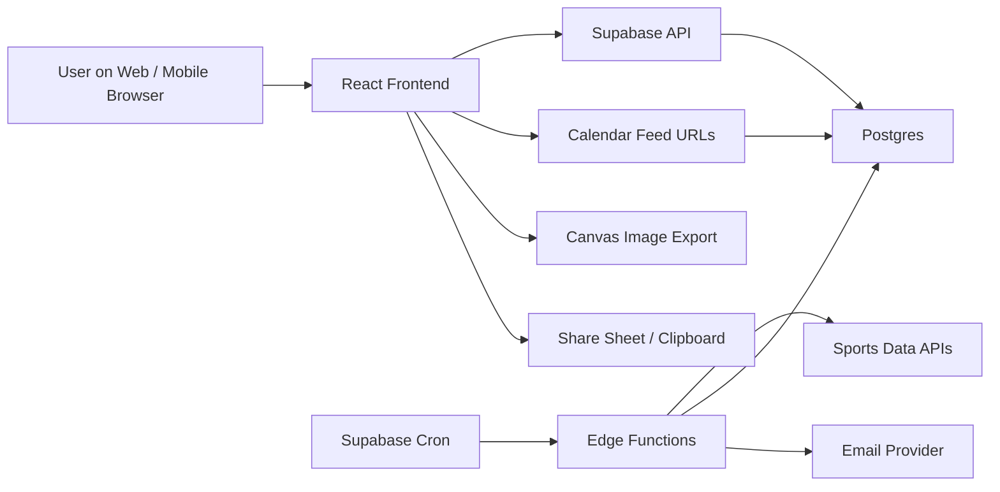
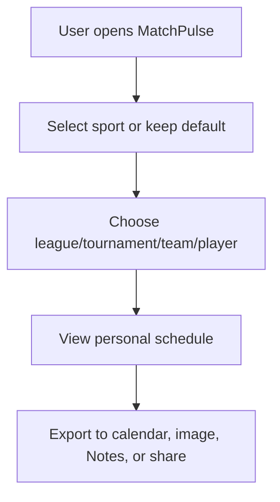

# MatchPulse Full Product And Technical Plan

Last updated: June 11, 2026

## Purpose

This document is the working plan for turning MatchPulse from a World Cup scheduler prototype into a full multi-sport personal schedule service. It is meant to be shared with development teams and reused by Codex as the durable source of truth for product scope, backend architecture, frontend architecture, design direction, implementation sequence, and acceptance criteria.

SMS is intentionally excluded from this plan. Email reminders, calendar subscriptions, image exports, share sheets, and Notes-friendly text are included.

## One Sentence Vision

MatchPulse is the easiest way to follow the sports events you personally care about, across pro leagues, tournaments, Formula 1 weekends, tennis and golf events, and custom kids/community leagues, then push that schedule into your calendar, phone photos, notes, or family group chat.

## Product Wedge

FotMob is a strong inspiration for soccer UX because it has excellent daily match views, favorite teams, notifications, lineups, stats, news, and match detail pages. MatchPulse should not try to clone FotMob or scrape it. The differentiated product is personal scheduling:

- Less global live-score overload.
- More "what do I need to watch, attend, save, or share?"
- Strong calendar subscription support.
- Beautiful readable image exports.
- Plain text exports that work in Notes.
- Custom leagues for families, coaches, little leagues, pickup leagues, and kids sports.
- Multi-sport support from the beginning of the data model.

## Reference Inputs

### Current Prototype

The current repo contains a React/Vite prototype with:

- World Cup 2026 team selection.
- Local timezone conversion.
- `.ics` export.
- High-resolution readable PNG export.
- Phone share/download behavior.
- Notes-friendly copied schedule.
- Bright football-forward styling.

### Figma Make Result

File inspected:

`C:\Users\azhar\Downloads\MatchPulse Scheduler Interface.zip`

Useful ideas from the Figma Make design:

- Sticky green tournament header.
- Brighter pitch-green theme.
- Team count badge.
- Compact checklist-style team selector.
- Central schedule column.
- Right-side alert/export utility panel.
- Dedicated `1080 x 1920` poster concept.
- Clear split between calendar export and image export.
- Stronger "selected teams -> match schedule" hierarchy.

The Figma design uses mock data and some generated characters that need cleanup, but the product layout direction is useful.

### External Docs To Re-check Before Implementation

These links are planning references. Providers and platform terms can change, so verify before signing up or deploying:

- Supabase Scheduled Functions: https://supabase.com/docs/guides/functions/schedule-functions
- Supabase Cron: https://supabase.com/docs/guides/cron
- Supabase Edge Functions: https://supabase.com/docs/guides/functions
- Supabase Row Level Security: https://supabase.com/docs/guides/database/postgres/row-level-security
- TheSportsDB: https://www.thesportsdb.com/documentation
- API-Sports: https://api-sports.io/
- OpenF1: https://openf1.org/docs/
- SportsDataIO: https://sportsdata.io/apis
- Sportradar: https://developer.sportradar.com/getting-started/docs/get-started
- iCalendar RFC 5545: https://datatracker.ietf.org/doc/html/rfc5545
- Apple subscribed calendars: https://support.apple.com/guide/calendar/subscribe-to-calendars-icl1022/mac
- Outlook subscribe/import calendars: https://support.microsoft.com/en-us/office/import-or-subscribe-to-a-calendar-in-outlook-com-or-outlook-on-the-web-cff1429c-5af6-41ec-a5b4-74f2c278e98c
- Google Calendar shared/subscribed calendar help: https://support.google.com/calendar/answer/37100

## Guiding Principles

1. Mobile first, not mobile afterthought.
2. Calendar subscription is the preferred long-term export, not one-time file import.
3. Photo export prioritizes legibility over density.
4. Notes/plain text export should be clean enough to paste into Apple Notes, Google Keep, Notion, email, or a group chat.
5. Every sport uses one shared event model, but can have sport-specific language and themes.
6. Provider data is normalized into our database. The frontend should not depend directly on provider response shapes.
7. Custom leagues are first-class, not a hack.
8. RLS is mandatory for any user-owned or private data.
9. No scraping of FotMob or other apps. Use licensed APIs, public official feeds, or user-entered custom schedules.
10. The first production version should be useful even with limited live provider coverage.

## High-Level Architecture



## Core Domain Shape

The app should be built around generic events:

- A soccer match is an event.
- An NBA game is an event.
- An NHL game is an event.
- A Formula 1 practice, qualifying, sprint, or race is an event.
- A tennis match is an event.
- A golf round or tee time is an event.
- A kid's hockey practice is an event.

The sport controls labels, display rules, theme, and event subtypes. The backend storage stays mostly unified.

```ts
type SportKey = 'soccer' | 'f1' | 'nhl' | 'nba' | 'tennis' | 'golf' | 'custom';

type EventStatus =
  | 'scheduled'
  | 'time_tbd'
  | 'postponed'
  | 'cancelled'
  | 'live'
  | 'finished';

type EventKind =
  | 'match'
  | 'game'
  | 'race'
  | 'practice'
  | 'qualifying'
  | 'sprint'
  | 'round'
  | 'tee_time'
  | 'custom_event';

type ScheduleEvent = {
  id: string;
  sportKey: SportKey;
  leagueId: string | null;
  seasonId: string | null;
  providerId: string | null;
  providerEventId: string | null;
  kind: EventKind;
  status: EventStatus;
  startsAt: string | null;
  startsAtTbd: boolean;
  timezone: string | null;
  venueId: string | null;
  homeCompetitorId: string | null;
  awayCompetitorId: string | null;
  title: string;
  shortTitle: string;
  metadata: Record<string, unknown>;
};
```

## Objective 1: Product Foundation

### Goal

Reframe the app from a one-off World Cup scheduler into a multi-sport scheduling platform while keeping the current prototype useful.

### Frontend Work

- Add top-level product navigation:
  - My Schedule
  - Explore
  - Calendar
  - Exports
  - Custom Leagues
- Add sport switcher:
  - Soccer
  - F1
  - NHL
  - NBA
  - Tennis
  - Golf
  - Custom
- Keep current World Cup view as the first soccer/tournament demo.
- Replace hardcoded copy like "World Cup local-time watch planner" with context-aware titles.
- Add empty/loading states for unsupported sports while backend integrations are pending.

### Backend Work

- None required for the first refactor if we keep local demo data.
- Create placeholder types that match the future backend schema.

### Flow



### Code Concept

```ts
const sports = [
  { key: 'soccer', label: 'Soccer', enabled: true },
  { key: 'f1', label: 'F1', enabled: false },
  { key: 'nhl', label: 'NHL', enabled: false },
  { key: 'nba', label: 'NBA', enabled: false },
  { key: 'tennis', label: 'Tennis', enabled: false },
  { key: 'golf', label: 'Golf', enabled: false },
  { key: 'custom', label: 'Custom', enabled: false },
] as const;
```

### Acceptance Criteria

- The app still works for the World Cup scheduler.
- Users can see the broader multi-sport structure.
- Unsupported sport states feel intentional, not broken.
- Mobile layout remains clean.

## Objective 2: Design System And Sports Themes

### Goal

Create one consistent MatchPulse design system that can change mood by sport, league, tournament, or race country without becoming seven separate products.

### Design Direction

Base design:

- Bright, clean, mobile-first.
- White and translucent panels.
- Strong readable text.
- Sports texture in the background, not behind dense body copy.
- Export CTAs use higher energy colors.

Sport themes:

- Soccer: pitch stripes, stadium lines, trophy gold, lime/cyan.
- World Cup: FIFA/WC inspired greens, gold, bright global/tournament accents.
- EPL: red, white, navy, crisp broadcast feel.
- La Liga: red/yellow, warmer sunlit stadium cues.
- Bundesliga: red/yellow/black, bold high contrast.
- Ligue 1: red/blue/white.
- F1: track curves, carbon fiber, timing tower, race-country accents.
- NHL: ice texture, rink lines, cold white/blue, puck/scoreboard motifs.
- NBA: court wood, orange/black, arena lights.
- Tennis: hard/clay/grass court variants.
- Golf: scorecard, fairway green, understated clubhouse palette.
- Olympics: ring-color accent system, clean international event look.

### Frontend Work

- Add a `themes.ts` file.
- Add CSS variables for theme tokens.
- Add `SportThemeProvider` at app root.
- Convert current CSS colors into theme variables.
- Build `ScheduleCard`, `TeamChip`, `ExportButton`, `SportSwitcher`, `LeagueBadge`, `EventTimeBlock` components.
- Add visual QA at desktop, iPhone width, Android width.

### Backend Work

- Store optional theme metadata on sports/leagues/events:
  - primary color
  - secondary color
  - accent color
  - background motif
  - logo/artwork URL
  - theme mode

### Code Concept

```ts
export type SportTheme = {
  key: string;
  label: string;
  colors: {
    bg: string;
    surface: string;
    text: string;
    primary: string;
    secondary: string;
    accent: string;
    export: string;
  };
  motifs: {
    background: 'pitch' | 'track' | 'ice' | 'court' | 'fairway' | 'rings' | 'neutral';
    cardShape: 'ticket' | 'scoreboard' | 'slab' | 'poster';
  };
};

export const soccerTheme: SportTheme = {
  key: 'soccer',
  label: 'Soccer',
  colors: {
    bg: '#e4fae8',
    surface: '#ffffff',
    text: '#0b2819',
    primary: '#0c5c31',
    secondary: '#d8ff49',
    accent: '#42e7ff',
    export: '#ff6b1a',
  },
  motifs: {
    background: 'pitch',
    cardShape: 'ticket',
  },
};
```

```tsx
function SportThemeProvider({ theme, children }: PropsWithChildren<{ theme: SportTheme }>) {
  return (
    <div
      data-sport={theme.key}
      style={{
        '--mp-bg': theme.colors.bg,
        '--mp-surface': theme.colors.surface,
        '--mp-text': theme.colors.text,
        '--mp-primary': theme.colors.primary,
        '--mp-secondary': theme.colors.secondary,
        '--mp-accent': theme.colors.accent,
        '--mp-export': theme.colors.export,
      } as React.CSSProperties}
    >
      {children}
    </div>
  );
}
```

### Acceptance Criteria

- Changing a sport key changes theme without changing component code.
- World Cup, F1, NHL, and NBA can be mocked with distinct looks.
- Export images use the same theme tokens.
- The UI never becomes illegible because of a theme.

## Objective 3: Supabase Backend Foundation

### Goal

Build a durable backend that can store sports, leagues, provider events, user follows, calendar feeds, custom leagues, and reminders.

### Frontend Work

- Add Supabase client.
- Add auth UI only where needed:
  - save follows
  - manage custom leagues
  - manage feeds
  - manage email reminders
- Keep anonymous browsing possible.

### Backend Work

- Create Supabase project.
- Add schema migrations.
- Enable RLS.
- Create public read policies for public sports data.
- Create user-scoped policies for saved preferences and custom league admin data.
- Add Edge Function scaffolds.
- Add Cron job scaffolds.

### Schema Concept

```sql
create table public.sports (
  id uuid primary key default gen_random_uuid(),
  key text not null unique,
  name text not null,
  default_theme jsonb not null default '{}'::jsonb,
  created_at timestamptz not null default now()
);

create table public.leagues (
  id uuid primary key default gen_random_uuid(),
  sport_id uuid not null references public.sports(id),
  provider_key text,
  provider_league_id text,
  name text not null,
  short_name text,
  country text,
  logo_url text,
  theme jsonb not null default '{}'::jsonb,
  is_public boolean not null default true,
  created_at timestamptz not null default now(),
  unique (provider_key, provider_league_id)
);

create table public.seasons (
  id uuid primary key default gen_random_uuid(),
  league_id uuid not null references public.leagues(id),
  label text not null,
  starts_on date,
  ends_on date,
  provider_season_id text,
  is_current boolean not null default false
);

create table public.venues (
  id uuid primary key default gen_random_uuid(),
  name text not null,
  city text,
  region text,
  country text,
  timezone text,
  latitude double precision,
  longitude double precision
);

create table public.competitors (
  id uuid primary key default gen_random_uuid(),
  sport_id uuid not null references public.sports(id),
  league_id uuid references public.leagues(id),
  kind text not null check (kind in ('team', 'person', 'constructor', 'custom_team')),
  name text not null,
  short_name text,
  country text,
  logo_url text,
  theme jsonb not null default '{}'::jsonb,
  provider_key text,
  provider_competitor_id text,
  unique (provider_key, provider_competitor_id)
);

create table public.events (
  id uuid primary key default gen_random_uuid(),
  sport_id uuid not null references public.sports(id),
  league_id uuid references public.leagues(id),
  season_id uuid references public.seasons(id),
  venue_id uuid references public.venues(id),
  provider_key text,
  provider_event_id text,
  kind text not null,
  status text not null default 'scheduled',
  title text not null,
  short_title text,
  starts_at timestamptz,
  starts_at_tbd boolean not null default false,
  timezone text,
  home_competitor_id uuid references public.competitors(id),
  away_competitor_id uuid references public.competitors(id),
  metadata jsonb not null default '{}'::jsonb,
  version integer not null default 1,
  created_at timestamptz not null default now(),
  updated_at timestamptz not null default now(),
  unique (provider_key, provider_event_id)
);

create table public.event_status_history (
  id uuid primary key default gen_random_uuid(),
  event_id uuid not null references public.events(id) on delete cascade,
  old_status text,
  new_status text,
  old_starts_at timestamptz,
  new_starts_at timestamptz,
  changed_at timestamptz not null default now(),
  source text not null
);
```

### RLS Concept

```sql
alter table public.sports enable row level security;
alter table public.leagues enable row level security;
alter table public.events enable row level security;

create policy "public sports are readable"
on public.sports for select
to anon, authenticated
using (true);

create policy "public leagues are readable"
on public.leagues for select
to anon, authenticated
using (is_public = true);

create policy "public events are readable"
on public.events for select
to anon, authenticated
using (true);
```

### Acceptance Criteria

- Local migrations exist.
- RLS enabled for exposed public tables.
- Public schedule data can be read by anonymous users.
- Private user/custom data cannot be read by other users.

## Objective 4: Provider Integration And Normalization

### Goal

Pull live schedule data from external sports APIs, normalize it into our event model, and track changes over time.

### Provider Strategy

Start with:

1. TheSportsDB or API-Sports for broad multi-sport schedule coverage.
2. OpenF1 for a strong F1 path.
3. Keep World Cup JSON/static import as a demo/fallback.

Evaluate later:

- SportsDataIO for North American sports.
- Sportradar or Stats Perform for enterprise coverage.

### Frontend Work

- Show provider freshness:
  - "Updated 12 min ago"
  - "Schedule source: API-Sports"
  - "Times may change"
- Add schedule changed UI markers.

### Backend Work

- Create provider adapter interface.
- Create sync Edge Function.
- Create Cron schedule by provider/sport.
- Store raw provider payload snapshots for debugging.
- Upsert leagues, teams/competitors, venues, and events.
- Insert status history when event time/status changes.

### Provider Adapter Concept

```ts
export type ProviderKey = 'worldcup_json' | 'thesportsdb' | 'api_sports' | 'openf1';

export type ProviderEvent = {
  providerKey: ProviderKey;
  providerEventId: string;
  sportKey: SportKey;
  leagueExternalId?: string;
  seasonExternalId?: string;
  kind: EventKind;
  status: EventStatus;
  title: string;
  shortTitle?: string;
  startsAt?: string;
  startsAtTbd?: boolean;
  timezone?: string;
  venue?: {
    name: string;
    city?: string;
    country?: string;
    timezone?: string;
  };
  competitors: Array<{
    role: 'home' | 'away' | 'driver' | 'player' | 'field';
    providerCompetitorId?: string;
    name: string;
    shortName?: string;
    country?: string;
  }>;
  metadata: Record<string, unknown>;
  raw: unknown;
};

export interface SportsProviderAdapter {
  key: ProviderKey;
  listLeagues(): Promise<ProviderLeague[]>;
  listEvents(input: { leagueId?: string; season?: string; from: string; to: string }): Promise<ProviderEvent[]>;
}
```

### Sync Edge Function Concept

```ts
import { createClient } from 'npm:@supabase/supabase-js';
import { getAdapter } from './providers/index.ts';

Deno.serve(async (req) => {
  const { providerKey, sportKey, from, to } = await req.json();
  const supabase = createClient(
    Deno.env.get('SUPABASE_URL')!,
    Deno.env.get('SUPABASE_SERVICE_ROLE_KEY')!,
  );

  const adapter = getAdapter(providerKey);
  const providerEvents = await adapter.listEvents({ from, to });

  for (const providerEvent of providerEvents) {
    await upsertNormalizedEvent(supabase, providerEvent);
  }

  await supabase.from('provider_sync_runs').insert({
    provider_key: providerKey,
    sport_key: sportKey,
    status: 'success',
    fetched_count: providerEvents.length,
  });

  return Response.json({ ok: true, count: providerEvents.length });
});
```

### Acceptance Criteria

- One provider can sync events into Postgres.
- Re-running sync updates existing events rather than duplicating.
- Time/status changes create status history rows.
- Frontend can display provider freshness.

## Objective 5: User Follows And Personal Schedule

### Goal

Let users build a personal schedule by following sports, leagues, teams, competitors, players/drivers, and custom leagues.

### Frontend Work

- Follow buttons on:
  - sport
  - league
  - team
  - player/driver
  - custom league
- "My Schedule" page.
- Date range controls:
  - Today
  - This Weekend
  - Next 7 Days
  - Tournament
  - Custom range
- Filter toggles:
  - Watching
  - Attending
  - My teams
  - Finals/playoffs only
  - Hide finished

### Backend Work

- Store follows.
- Store per-user timezone and preferred city.
- Store saved schedule preferences.
- Build RPC/view for personal schedule.

### Schema Concept

```sql
create table public.profiles (
  user_id uuid primary key references auth.users(id) on delete cascade,
  display_name text,
  default_timezone text,
  default_city text,
  created_at timestamptz not null default now(),
  updated_at timestamptz not null default now()
);

create table public.user_follows (
  id uuid primary key default gen_random_uuid(),
  user_id uuid not null references auth.users(id) on delete cascade,
  target_type text not null check (target_type in ('sport', 'league', 'team', 'competitor', 'player', 'custom_league')),
  target_id uuid not null,
  intent text not null default 'watch' check (intent in ('watch', 'attend', 'track')),
  created_at timestamptz not null default now(),
  unique (user_id, target_type, target_id, intent)
);

alter table public.user_follows enable row level security;

create policy "users manage their follows"
on public.user_follows
for all
to authenticated
using (auth.uid() = user_id)
with check (auth.uid() = user_id);
```

### Personal Schedule Query Concept

```sql
create or replace function public.get_my_schedule(
  start_at timestamptz,
  end_at timestamptz
)
returns setof public.events
language sql
security invoker
as $$
  select distinct e.*
  from public.events e
  join public.user_follows f
    on f.user_id = auth.uid()
   and (
     (f.target_type = 'league' and f.target_id = e.league_id)
     or (f.target_type = 'team' and f.target_id in (e.home_competitor_id, e.away_competitor_id))
     or (f.target_type = 'sport' and f.target_id = e.sport_id)
   )
  where e.starts_at >= start_at
    and e.starts_at < end_at
  order by e.starts_at asc;
$$;
```

### Acceptance Criteria

- Authenticated users can save follows.
- My Schedule aggregates followed targets.
- Anonymous users can still use temporary local follows.
- Mobile follow/unfollow states are obvious.

## Objective 6: Calendar Feeds And Schedule Updates

### Goal

Support both one-time `.ics` downloads and live subscribed calendar feeds that update when event times change.

### Product Rule

- "Download .ics" is a snapshot.
- "Subscribe calendar" is the live version.
- The product should strongly prefer subscribed calendars when a user wants ongoing updates.

### Frontend Work

- Calendar page:
  - Create feed
  - Name feed
  - Choose what it includes
  - Copy URL
  - Add to Apple Calendar
  - Add to Google Calendar
  - Add to Outlook
- Explain refresh limitations:
  - Calendar apps decide their own refresh timing.
  - Updates are not always instant.
- Feed management:
  - regenerate token
  - disable feed
  - delete feed

### Backend Work

- Store feed tokens.
- Generate iCalendar from DB.
- Use stable `UID` values.
- Include `DTSTAMP`, `LAST-MODIFIED`, `SEQUENCE`.
- Increment event version on meaningful time/status changes.

### Schema Concept

```sql
create table public.calendar_feeds (
  id uuid primary key default gen_random_uuid(),
  user_id uuid references auth.users(id) on delete cascade,
  token text not null unique,
  name text not null,
  timezone text not null,
  filters jsonb not null default '{}'::jsonb,
  is_active boolean not null default true,
  created_at timestamptz not null default now(),
  updated_at timestamptz not null default now()
);

alter table public.calendar_feeds enable row level security;

create policy "users manage their calendar feeds"
on public.calendar_feeds
for all
to authenticated
using (auth.uid() = user_id)
with check (auth.uid() = user_id);
```

### Calendar Generator Concept

```ts
function eventToIcs(event: ScheduleEvent) {
  const uid = `${event.id}@matchpulse.app`;
  const sequence = event.version ?? 1;
  const dtstamp = formatIcsDate(new Date());
  const lastModified = formatIcsDate(new Date(event.updatedAt));

  return [
    'BEGIN:VEVENT',
    `UID:${uid}`,
    `SEQUENCE:${sequence}`,
    `DTSTAMP:${dtstamp}`,
    `LAST-MODIFIED:${lastModified}`,
    `DTSTART:${formatIcsDate(new Date(event.startsAt!))}`,
    `DTEND:${formatIcsDate(addHours(new Date(event.startsAt!), 2))}`,
    `SUMMARY:${escapeIcsText(event.title)}`,
    event.venueName ? `LOCATION:${escapeIcsText(event.venueName)}` : '',
    `DESCRIPTION:${escapeIcsText(event.description ?? '')}`,
    'END:VEVENT',
  ].filter(Boolean).join('\r\n');
}
```

### Feed Route Concept

```ts
// Edge Function: GET /calendar/:token.ics
Deno.serve(async (req) => {
  const token = new URL(req.url).pathname.split('/').pop()?.replace('.ics', '');
  const feed = await loadFeedByToken(token);

  if (!feed?.is_active) {
    return new Response('Not found', { status: 404 });
  }

  const events = await loadEventsForFeed(feed);
  const ics = renderCalendar(feed, events);

  return new Response(ics, {
    headers: {
      'content-type': 'text/calendar; charset=utf-8',
      'cache-control': 'public, max-age=300',
    },
  });
});
```

### Acceptance Criteria

- One-time `.ics` download works.
- Subscription URL works without login because it uses an unguessable token.
- Updated event times are reflected in the feed.
- Deleted/disabled feed returns 404.
- Instructions exist for Apple, Google, and Outlook.

## Objective 7: Multi-Sport Frontend Experience

### Goal

Build an interface that works for soccer, F1, NHL, NBA, Tennis, Golf, and custom leagues without clutter.

### Key Screens

1. My Schedule
   - The default home screen after onboarding.
   - Shows only followed items.

2. Explore Sports
   - Choose sport, league, tournament, team, player/driver.

3. League/Tournament Page
   - Schedule, standings link/placeholder, follow controls.

4. Team/Competitor Page
   - Upcoming events, calendar/feed buttons, export image.

5. Event Detail
   - Time, venue, broadcast, status, follow/attend, export/share.

6. Calendar Feeds
   - Create/manage live calendar subscriptions.

7. Export Studio
   - Calendar, image, Notes, share settings.

8. Custom League Admin
   - Create league, teams, events, share link.

### Frontend Components

```text
AppShell
SportSwitcher
LeaguePicker
FollowButton
ScheduleList
ScheduleCard
EventTimeBlock
EventStatusBadge
ThemeBackground
ExportPanel
CalendarFeedPanel
ImageExportPreview
NotesExportPanel
CustomLeagueForm
CustomEventEditor
```

### Example Route Shape

```ts
const routes = [
  '/my-schedule',
  '/sports/:sportKey',
  '/leagues/:leagueId',
  '/teams/:teamId',
  '/events/:eventId',
  '/calendar',
  '/exports',
  '/custom-leagues',
  '/custom-leagues/:leagueId/admin',
  '/s/:publicShareToken',
];
```

### Acceptance Criteria

- One app shell supports all sports.
- Soccer remains best polished first.
- F1 and NHL can be shown with mocked themed data before live provider work.
- Mobile navigation is not crowded.

## Objective 8: Photo, Share, And Notes Export Studio

### Goal

Create the best schedule export experience of any sports app.

### Product Rules

- Calendar is best for ongoing schedule tracking.
- Photo is best for quick visual reference and sharing.
- Notes/plain text is best for family planning and simple copy-paste.
- Big schedules must paginate.
- Photo export must never become tiny unreadable text.

### Frontend Work

- Export Studio UI:
  - Export target: Calendar, Photos, Notes, Share
  - Range: Today, Weekend, Next 7 Days, Team, League, Custom
  - Template: Compact, Poster, Family, Tournament
  - Page size: phone story, square, printable, compact list
- Preview before export.
- Use Web Share API when available.
- Fallback to download or clipboard.

### Backend Work

- Optional later: store export presets.
- Optional later: server-render export images for social previews.
- Not required for MVP because canvas export can happen client-side.

### Image Export Pagination Concept

```ts
const MAX_EVENTS_BY_TEMPLATE = {
  story: 7,
  poster: 9,
  compact: 12,
  family: 6,
};

function paginateEvents(events: ScheduleEvent[], template: keyof typeof MAX_EVENTS_BY_TEMPLATE) {
  const size = MAX_EVENTS_BY_TEMPLATE[template];
  const pages: ScheduleEvent[][] = [];

  for (let i = 0; i < events.length; i += size) {
    pages.push(events.slice(i, i + size));
  }

  return pages;
}
```

### Notes Export Concept

```ts
function buildNotesSchedule(events: ScheduleEvent[], timezone: string) {
  return groupByDay(events, timezone)
    .map((group) => {
      const rows = group.events.map((event) => {
        return [
          `${formatTime(event.startsAt, timezone)} - ${event.title}`,
          event.venueName ? `Venue: ${event.venueName}` : '',
          event.broadcast ? `Watch: ${event.broadcast}` : '',
        ].filter(Boolean).join('\n');
      });

      return [`${group.label}`, ...rows].join('\n\n');
    })
    .join('\n\n');
}
```

### Acceptance Criteria

- A 30-event schedule exports as multiple readable images.
- Each image has title, timezone, date range, page count, and readable event rows.
- Notes export is grouped by date.
- Mobile share sheet works when supported.
- Fallbacks work in desktop browsers.

## Objective 9: Custom Leagues

### Goal

Let parents, coaches, organizers, and friends create and share schedules for little league, kids sports, pickup leagues, school teams, or local tournaments.

### Frontend Work

- Custom League creation:
  - league name
  - sport
  - timezone
  - location
  - theme
- Team creation.
- Event creation:
  - opponent/team
  - date/time
  - venue
  - arrival time
  - uniform color
  - notes
  - status
- Public share page:
  - read-only schedule
  - subscribe calendar
  - save image
  - copy Notes
- Admin page:
  - edit schedule
  - notify subscribers by email later

### Backend Work

- Store custom leagues and teams.
- Store memberships/admin roles.
- Store custom events in the same `events` table or a linked table.
- Public share token for read-only access.
- Calendar feed support for custom leagues.

### Schema Concept

```sql
create table public.custom_leagues (
  id uuid primary key default gen_random_uuid(),
  owner_user_id uuid not null references auth.users(id) on delete cascade,
  sport_id uuid references public.sports(id),
  name text not null,
  timezone text not null,
  public_token text not null unique,
  theme jsonb not null default '{}'::jsonb,
  created_at timestamptz not null default now(),
  updated_at timestamptz not null default now()
);

create table public.custom_league_members (
  id uuid primary key default gen_random_uuid(),
  custom_league_id uuid not null references public.custom_leagues(id) on delete cascade,
  user_id uuid not null references auth.users(id) on delete cascade,
  role text not null check (role in ('owner', 'admin', 'viewer')),
  unique (custom_league_id, user_id)
);

create table public.custom_teams (
  id uuid primary key default gen_random_uuid(),
  custom_league_id uuid not null references public.custom_leagues(id) on delete cascade,
  name text not null,
  color text,
  created_at timestamptz not null default now()
);
```

### RLS Concept

```sql
alter table public.custom_leagues enable row level security;
alter table public.custom_league_members enable row level security;
alter table public.custom_teams enable row level security;

create policy "owners can manage custom leagues"
on public.custom_leagues
for all
to authenticated
using (auth.uid() = owner_user_id)
with check (auth.uid() = owner_user_id);
```

### Acceptance Criteria

- User can create a custom league.
- User can add/edit/delete custom events.
- Public share page does not require login.
- Calendar subscription works for custom league.
- Image and Notes exports work for custom league.

## Objective 10: Email Alerts

### Goal

Send useful email reminders and change notifications without SMS.

### Frontend Work

- Alert settings:
  - reminder lead time
  - schedule changed
  - event cancelled/postponed
  - new event added
- Per-feed and per-follow alert controls.
- Clear opt-in language.
- Unsubscribe/manage link in every email.

### Backend Work

- Store alert preferences.
- Use Edge Function and Cron to find upcoming reminders.
- Use provider sync change history to trigger schedule-change emails.
- Integrate with email provider such as Resend, Postmark, or SendGrid.

### Schema Concept

```sql
create table public.alert_preferences (
  id uuid primary key default gen_random_uuid(),
  user_id uuid not null references auth.users(id) on delete cascade,
  target_type text not null,
  target_id uuid not null,
  email_enabled boolean not null default true,
  remind_minutes_before integer not null default 60,
  notify_time_changes boolean not null default true,
  notify_cancellations boolean not null default true,
  created_at timestamptz not null default now(),
  updated_at timestamptz not null default now()
);

create table public.email_notifications (
  id uuid primary key default gen_random_uuid(),
  user_id uuid references auth.users(id) on delete set null,
  event_id uuid references public.events(id) on delete cascade,
  kind text not null,
  scheduled_for timestamptz not null,
  sent_at timestamptz,
  status text not null default 'pending',
  error text
);
```

### Reminder Function Concept

```ts
Deno.serve(async () => {
  const dueNotifications = await loadDueNotifications();

  for (const notification of dueNotifications) {
    try {
      await sendReminderEmail(notification);
      await markNotificationSent(notification.id);
    } catch (error) {
      await markNotificationFailed(notification.id, String(error));
    }
  }

  return Response.json({ ok: true, count: dueNotifications.length });
});
```

### Acceptance Criteria

- Users can opt into email reminders.
- Due reminders are queued and sent.
- Time change notifications are sent only when meaningful.
- Unsubscribe/manage link exists.
- No SMS implementation.

## Objective 11: Admin, Observability, And Operations

### Goal

Make the service maintainable as data providers, sync jobs, and schedule updates multiply.

### Frontend Work

- Admin dashboard:
  - provider sync status
  - failed syncs
  - event update counts
  - recent changed events
  - user-created leagues moderation list
- Basic support tooling:
  - find user by email
  - inspect calendar feeds
  - disable abusive public shares

### Backend Work

- `provider_sync_runs` table.
- Error logs table or external logging.
- Rate-limit Edge Functions.
- Store provider raw payload references when useful.
- Add indexes for schedule queries.

### Schema Concept

```sql
create table public.provider_sync_runs (
  id uuid primary key default gen_random_uuid(),
  provider_key text not null,
  sport_key text not null,
  league_id uuid references public.leagues(id),
  status text not null check (status in ('running', 'success', 'failed')),
  fetched_count integer not null default 0,
  changed_count integer not null default 0,
  error text,
  started_at timestamptz not null default now(),
  finished_at timestamptz
);

create index events_starts_at_idx on public.events (starts_at);
create index events_league_starts_idx on public.events (league_id, starts_at);
create index events_home_idx on public.events (home_competitor_id, starts_at);
create index events_away_idx on public.events (away_competitor_id, starts_at);
```

### Acceptance Criteria

- Sync failures are visible.
- Event queries are indexed.
- Calendar feed requests can be debugged.
- Admin access is restricted.

## Objective 12: Deployment And Delivery

### Goal

Ship a public web app with a reliable backend, clear environment setup, and repeatable deployment path.

### Frontend Work

- Deploy frontend to Vercel, Netlify, Cloudflare Pages, or Supabase Hosting if suitable.
- Add environment variables:
  - Supabase URL
  - Supabase anon/publishable key
  - app URL
- Add SEO/social previews.
- Add PWA manifest later if useful.

### Backend Work

- Supabase project setup.
- Migrations checked into repo.
- Edge Functions checked into repo.
- Cron jobs documented as SQL.
- Email provider secrets stored securely.

### CI Work

- GitHub Actions:
  - install
  - typecheck/build
  - lint
  - maybe Playwright smoke test later

### GitHub Action Concept

```yaml
name: CI

on:
  push:
    branches: [main]
  pull_request:

jobs:
  build:
    runs-on: ubuntu-latest
    steps:
      - uses: actions/checkout@v4
      - uses: actions/setup-node@v4
        with:
          node-version: 22
          cache: npm
      - run: npm ci
      - run: npm run build
```

### Acceptance Criteria

- Fresh clone can run `npm install` and `npm run build`.
- Production deploy has documented env vars.
- Backend migrations are repeatable.
- CI blocks broken builds.

## Objective 13: Quality And Security

### Goal

Protect users, keep data accurate, and avoid accidental public leakage.

### Frontend Checks

- Mobile visual QA at:
  - iPhone SE width
  - iPhone modern width
  - Android common width
  - tablet
  - desktop
- Export QA:
  - image readability
  - calendar import
  - calendar subscription
  - Notes text
- Accessibility:
  - keyboard navigation
  - focus states
  - color contrast
  - reduced motion

### Backend Checks

- RLS tests.
- Feed token tests.
- Provider sync idempotency tests.
- Calendar UID/SEQUENCE update tests.
- Custom league permissions tests.
- Email reminder duplication tests.

### Example Test Concepts

```ts
test('image export paginates long schedules', () => {
  const pages = paginateEvents(makeEvents(31), 'poster');
  expect(pages).toHaveLength(4);
  expect(pages[0]).toHaveLength(9);
});

test('calendar events keep stable UID after time change', () => {
  const before = eventToIcs({ ...event, startsAt: oldTime, version: 1 });
  const after = eventToIcs({ ...event, startsAt: newTime, version: 2 });

  expect(extractUid(before)).toEqual(extractUid(after));
  expect(extractSequence(after)).toEqual(2);
});
```

### Acceptance Criteria

- No user can read another user's private follows, feeds, or custom league admin data.
- Public share pages expose only intended public data.
- Exports remain readable.
- Build and core tests pass before deploy.

## Suggested Milestones

### Milestone 0: Planning And Design Lock

Deliverables:

- This document.
- Figma inspiration reviewed.
- GitHub issues created.
- Provider shortlist chosen.

### Milestone 1: Multi-Sport Frontend Refactor

Deliverables:

- App shell.
- Sport switcher.
- Theme system.
- Soccer/World Cup still working.
- Mock F1/NHL/NBA examples.
- Mobile QA.

### Milestone 2: Supabase Foundation

Deliverables:

- Supabase project.
- Migrations.
- RLS.
- Public schedule reads.
- Auth profiles.
- Saved follows.

### Milestone 3: Live Provider Sync

Deliverables:

- One provider adapter.
- Sync Edge Function.
- Cron job.
- Events normalized into DB.
- Provider freshness visible.

### Milestone 4: Personal Calendar Feeds

Deliverables:

- User can create feed.
- Public tokenized `.ics` URL.
- Apple/Google/Outlook instructions.
- Stable UID/version behavior.

### Milestone 5: Export Studio

Deliverables:

- Calendar export.
- Subscribed calendar.
- Paginated image export.
- Notes export.
- Share sheet fallback behavior.

### Milestone 6: Custom Leagues

Deliverables:

- Create custom league.
- Add teams/events.
- Public share page.
- Calendar feed.
- Image and Notes export.

### Milestone 7: Email Alerts

Deliverables:

- Email opt-in.
- Reminder queue.
- Time-change notifications.
- Unsubscribe/manage.

### Milestone 8: Production Launch

Deliverables:

- Public deployment.
- CI.
- Admin sync dashboard.
- Terms/privacy basics.
- Monitoring.
- Initial supported sports/leagues list.

## Immediate Next Implementation Steps

1. Create GitHub issues from this plan.
2. Refactor frontend data types into `src/domain`.
3. Add theme system from Objective 2.
4. Add sport switcher with mocked sport states.
5. Add `docs/api-provider-evaluation.md` comparing TheSportsDB, API-Sports, OpenF1, and SportsDataIO.
6. Decide whether to create/upgrade Supabase project.
7. Add `supabase/` migration scaffold when project is ready.

## Definition Of Completion

MatchPulse is complete for this plan when:

- Users can follow sports/leagues/teams/competitors.
- Users can view a personal schedule across supported sports.
- Users can subscribe to live-updating calendar feeds.
- Users can export readable schedule images, paginated when needed.
- Users can copy/share Notes-friendly schedule text.
- Users can create and share custom leagues.
- Email reminders work.
- At least two live data sources are integrated.
- Soccer has FotMob-inspired polish without using FotMob data.
- F1, NHL, NBA, Tennis, Golf, and Custom are supported at least at the model/UI level.
- Mobile is excellent.
- Supabase RLS protects private data.
- CI and deployment are documented and working.

